### 1_lambda_with_s3
## S3 버킷 생성, 람다 함수 생성, IAM 역할 생성
### ARN 저장

# S3 버킷 생성

1. [AWS S3 랜딩 페이지 Amazon Web Services](https://s3.console.aws.amazon.com/s3/home?region=ap-northeast-2) 페이지에 접속합니다

2. **버킷 만들기**를 클릭 한뒤 버킷 이름 **ausg-'YOURNAME-origin'** 생성합니다
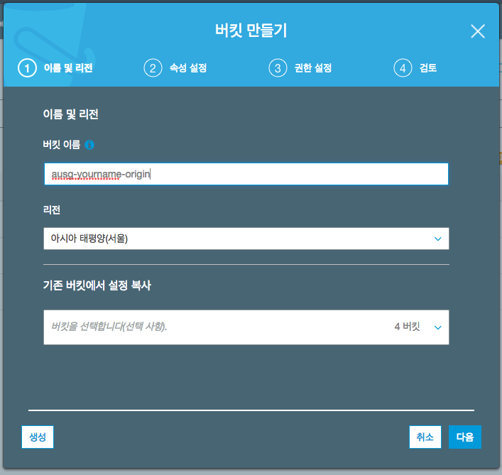

3. 버킷 이름 **ausg-'YOURNAME'-resized** 으로 버켓을 한개 더 생성 합니다.

4. 다음 버튼을 눌러 버킷 생성 한 뒤, 생성된 origin 버킷에 들어가 **images/** 폴더를 생성합니다.
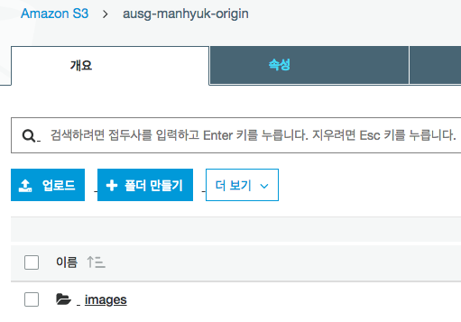
# 람다 함수 생성하기

1. [AWS Lambda 랜딩 페이지 Amazon Web Services](https://ap-northeast-2.console.aws.amazon.com/lambda/home?region=ap-northeast-2) 페이지에 접속합니다.

2. **함수 만들기** 클릭 (주의 서울리전에 생성!!)

3. 이름 **createThumbnailLambda** / 런타임 **Node.js 6.10** / 역할 **사용자 지정 / 역할 생성** 선택후 새 역할 생성 /역할 이름 **lambda_basic_execution** (디폴트) / 오른쪽 아래 **허용** 버튼 클릭
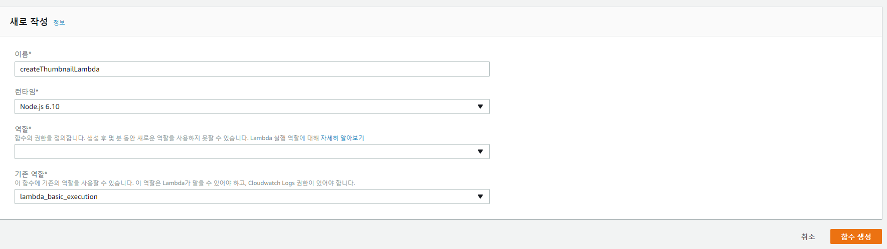    

4. 왼쪽 사이드 바에서 **S3** 트리거 추가
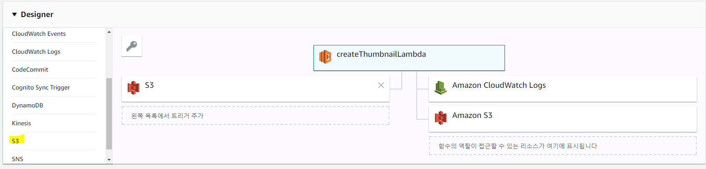

5. 트리거 구성 탭에서 생성했던 **'ausg-YOURNAME-origin'** 버킷 선택
6. 이벤트 유형 **객체 생성됨(모두)** 선택
7. 접두사 **images/** 입력
8. 트리거 활성화 **체크박스에 체크** 를 한뒤 추가 버튼 클릭
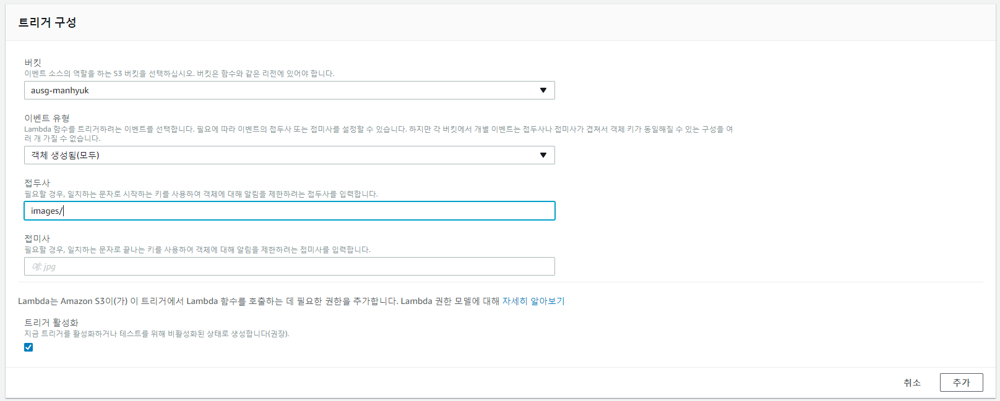

9. createThumbnailLambda 클릭
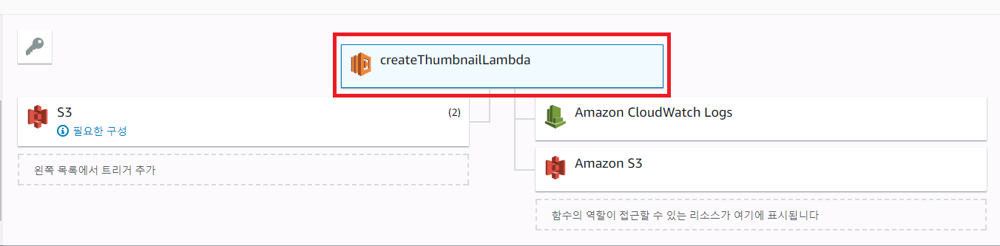
10. 텍스트 에디터를 실행한 뒤 새로운 폴더 생성

11. index.js 파일 추가 **(버킷 이름 설정 주의)**

```
// index.js

var async = require('async'); // 'async'모듈을 임포트하여 더 용이하게 함수 작성
var AWS = require('aws-sdk'); // AWS Lambda 실행 환경에 기본값으로 설치되어 있음
var gm = require('gm')
  .subClass({ imageMagick: true }); // imageMagick 연동 설정
var util = require('util');

// 썸네일 사이즈 기본값
var MAX_WIDTH  = 200;
var MAX_HEIGHT = 200;

var s3 = new AWS.S3();

exports.handler = function(event, context, callback) {

  // 이벤트를 발생시킨 버킷 및 S3객체의 키값 가져오기
  var srcBucket = event.Records[0].s3.bucket.name;
  var srcKey    = event.Records[0].s3.object.key;
  // 이미지가 저장될 버킷 설정
  var dstBucket = srcBucket + "-resized";
  var dstKey    = srcKey;

  // 버킷이 같으면 무한 루프
  if (srcBucket == dstBucket) {
    callback("Source and destination buckets are the same.");
    return;
  }

  // 이미지 타입에 대한 예외처리
  var typeMatch = srcKey.match(/\.([^.]*)$/);
  if (!typeMatch) {
    callback("Could not determine the image type.");
    return;
  }
  var imageType = typeMatch[1];
  if (imageType != "jpg" && imageType != "png") {
    callback('Unsupported image type: ${imageType}');
    return;
  }

  async.waterfall([
      function download(next) {
        // 이미지를 S3에서 가져옴
        s3.getObject({
            Bucket: srcBucket,
            Key: srcKey
          },
          next);
      },
      function transform(response, next) {
        gm(response.Body).size(function(err, size) {
          // 이미지를 변환하고 섬네일 생성
          var scalingFactor = Math.min(
            MAX_WIDTH / size.width,
            MAX_HEIGHT / size.height
          );
          var width  = scalingFactor * size.width;
          var height = scalingFactor * size.height;

          this.resize(width, height)
            .toBuffer(imageType, function(err, buffer) {
              if (err) {
                next(err);
              } else {
                next(null, response.ContentType, buffer);
              }
            });
        });
      },
      function upload(contentType, data, next) {
        // 섬네일을 s3에 업로드하는 함수
        s3.putObject({
            Bucket: dstBucket,
            Key: dstKey,
            Body: data,
            ContentType: contentType
          },
          next);
      }
    ], function (err) {
      if (err) {
        console.error(
          'Unable to resize ' + srcBucket + '/' + srcKey +
          ' and upload to ' + dstBucket + '/' + dstKey +
          ' due to an error: ' + err
        );
      } else {
        console.log(
          'Successfully resized ' + srcBucket + '/' + srcKey +
          ' and uploaded to ' + dstBucket + '/' + dstKey
        );
      }

      callback(null, "message");
    }
  );
};
```

12. 터미널(cmd) 실행
```
npm install async gm util
```

13. index.js외에 생성된 파일을들 함께 'CreateThumbnail'파일 명으로 압축

14. 람다 화면으로 돌아가서 코드 입력 유형 드롭다운 클릭
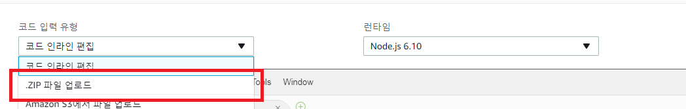

15. .zip 파일 업로드를 선택한뒤 압축파일 업로드

16. 제한시간 10초 설정
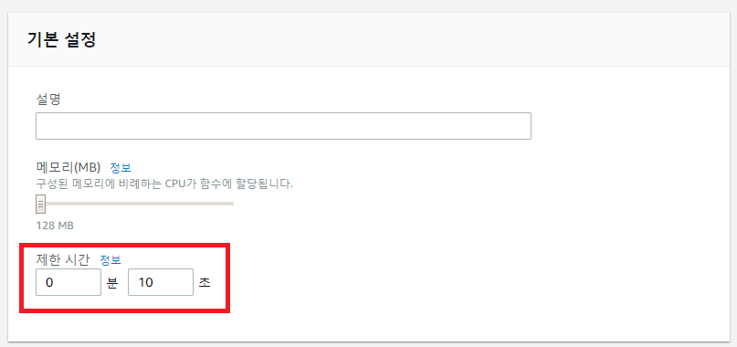

17. 상단 저장 클릭

# IAM 역할 만들기
1. [IAM 콘솔 이동](https://console.aws.amazon.com/iam/home?region=ap-northeast-2#/home)

2. 탭에서 정책을 선택한 뒤, 왼쪽 상단에 있는 '정책 생성' 버튼을 클릭합니다.


3. JSON 탭을 클릭, 코드를 복사합니다.
```
{
    "Version": "2012-10-17",
    "Statement": [
        {
            "Effect": "Allow",
            "Action": [
                "s3:GetObject"
            ],
            "Resource": [
                "arn:aws:s3:::<S3-ORIGIN-BUCKET-NAME>/images/*"
            ]
        },
        {
            "Effect": "Allow",
            "Action": [
                "s3:PutObject"
            ],
            "Resource": [
                "arn:aws:s3:::<S3-RESIZED-BUCKET-NAME>/images/*"
            ]
        }
    ]
}
```
4. 우측 하단에 **Review Policy** 버튼을 클릭한 뒤, 이름에 CreateThumbnailPolicy 을 입력하고 정책을 생성합니다.
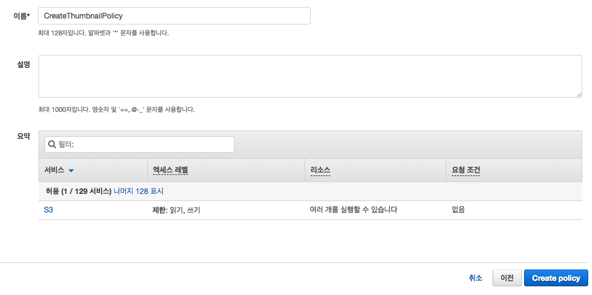

5. 콘솔의 역할 탭에서 역할 생성 버튼을 클릭합니다.
6. 여러 항목중 Lambda를 선택 합니다.
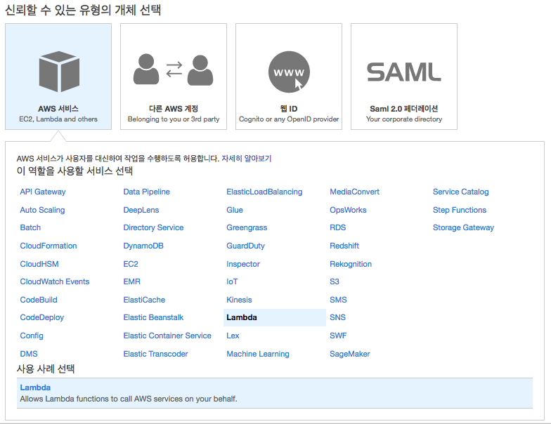

7. 방금 만든 정책인 CreateThumbnailPolicy를 검색한뒤 체크박스에 체크를 하고 다음 버튼을 클릭합니다.

8. 역할 이름에 CreateThumbnailRole 를 입력하고 역할 만들기를 클릭합니다.

9. 람다 콘솔로 돌아가 createThumbnailLambda 함수를 클릭합니다.

10. 화면을 내려 실행 역할 탭에서 '기존 역할 선택'을 선택하고 방금 만든 역할인 'CreateThumbnailRole'을 선택 합니다.
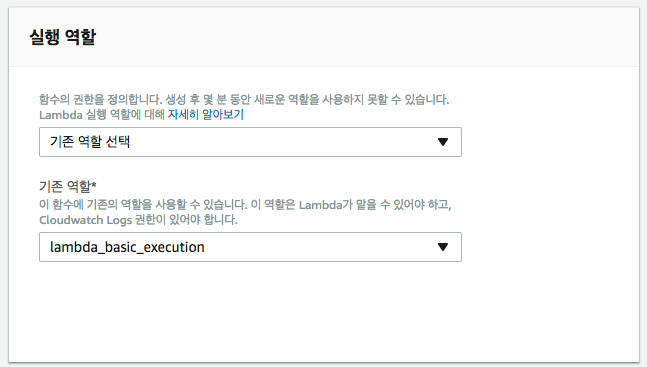

11. 우측 상단에 저장 버튼을 클릭합니다.

# 1부 마무리 및 테스트

S3 버켓을 생성하고, 람다 함수를 만들었으며 그에 맞는 역할까지 지정했습니다.


S3에 ausg-YOURNAME-origin 버켓에 images/ 디렉토리 안에 자신의 이미지를 올리게 되면

ausg-YOURNAMe-resized에 images/란 디렉토리 안에 리사이즈된 파일을 볼 수 있습니다.
