# 2_lambda_with_api_gateway


### IAM 역할 생성
1. [IAM 콘솔 이동](https://console.aws.amazon.com/iam/home?region=ap-northeast-2#/home)

2. 역할 탭에서 역할 생성을 클릭하고 Lambda를 선택합니다.


3. AmazonS3FullAccess 정책과 CloudWatchLogsFullAccess 정책을 체크한뒤 다음 버튼을 클릭합니다.
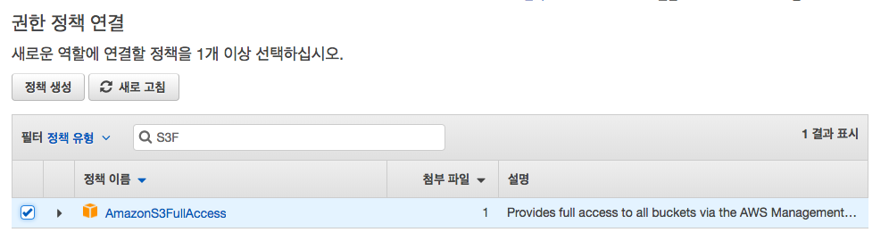

4. 역할 이름에 ImageUploadRole을 입력한뒤 역할 만들기 버튼을 클릭합니다.
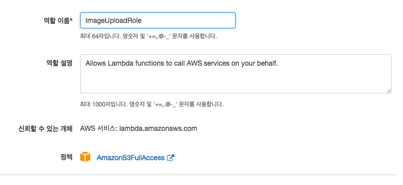


### 람다 함수 생성

1. [AWS Lambda 랜딩 페이지 Amazon Web Services](https://ap-northeast-2.console.aws.amazon.com/lambda/home?region=ap-northeast-2) 페이지에 접속합니다.
2. **함수 만들기** 클릭 (주의 서울리전에 생성!!)
3. 함수 이름 **imageUploadLambda** / 런타임 **Node.js 6.10** / 역할 **기존 역할 선택** 선택후 역할 이름 **ImageUploadRole** 선택 / 오른쪽 아래 **허용** 버튼 클릭
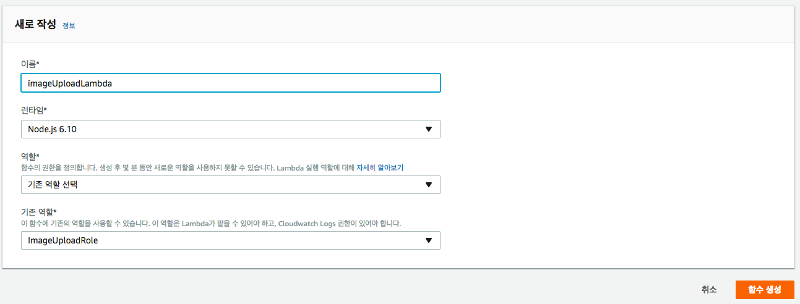

4. 에디터를 열어 index.js 파일을 추가하고, 코드를 붙여넣기 합니다

```
const AWS = require('aws-sdk');
const multipart = require("parse-multipart");
const s3 = new AWS.S3();
const bluebird = require('bluebird');

exports.handler = function(event, context) {

    let result = []

    const bodyBuffer = new Buffer( event[ 'body-json' ].toString(), 'base64' );

    const boundary = multipart.getBoundary( event.params.header[ 'Content-Type' ] )

    const parts = multipart.Parse( bodyBuffer, boundary )

    const files = getFiles( parts )

    return bluebird.map( files, file => {
        console.log('UploadCall')
        return upload( file )
        .then(
            data => {
                result.push( {
                    'bucket': data.Bucket,
                    'key': data.key,
                    'fileUrl': file.uploadFile.fullPath })
                console.log( `DATA => ${JSON.stringify( data, null, 2 )}` )
            },
            err => {
                console.log( `S3 UPLOAD ERR => ${err}` )
            }
        )
    })
    .then(_=> {
        return context.succeed(result)
    })
}

let upload = function( file ) {
    console.log( 'PutObject Call')
    return s3.upload( file.params ).promise();
};

let getFiles = function( parts ) {
    //let fileExt = 'png'
    let files = [];
    parts.forEach( part => {

        const buffer = part.data


        const fileName = part.filename
        const fileFullName = fileName;

        const originBucket = '<S3-ORIGIN-BUCKET-NAME>/images'
        const filefullPath = `https://s3.ap-northeast-2.amazonaws.com/${originBucket}/${fileFullName}`;


        const params = {
            Bucket: originBucket,
            Key: fileFullName,
            Body: buffer
        };

        const uploadFile = {
            size: buffer.toString( 'ascii' ).length,
            type: part.type,
            name: fileName,
            fullPath: filefullPath
        };
        files.push( { params, uploadFile } )
    } );
    return files
  }
```


5. 터미널에 명령어를 실행합니다

```
npm install parse-multipart bluebird
```

6. index.js 파일과 node_moudles 폴더를 함께 **'ImageUpload'** 로 압축합니다

7. 코드 입력유형 .zip 업로드로 변경뒤에 압축 파일을 업로드합니다.

### API GATEWAY

1. [AWS API GATEWAY 랜딩 페이지 Amazon Web Services](https://ap-northeast-2.console.aws.amazon.com/apigateway/home?region=ap-northeast-2#/welcome) 페이지에 접속합니다.

2. ImageUploadAPI으로 API를 생성합니다
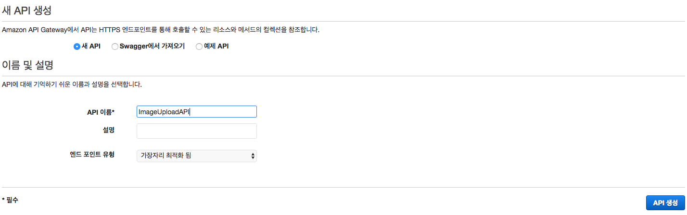

3. 작업 버튼을 클릭합니다.

4. 리소스 생성 클릭한뒤, 리소스 이름에 upload를 입력하고 리소스를 생성합니다.


6. 왼쪽 설정탭 클릭합니다

7. 이진 미디어 형식에 multipart/form-data 추가하고 Save Change를 클릭합니다.
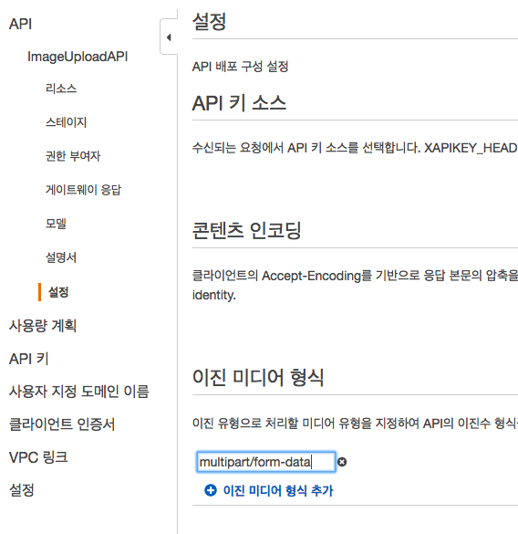


### API GATEWAY 배포
1. Upload 리소스에 POST 메서드 추가하고 체크버튼을 누릅니다.
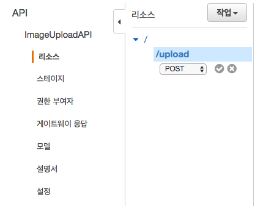

2. 통합 유형 - Lambda함수 / Lambda 리전 ap-northeast-2 / Lambda 함수 imageUploadLambda (자동완성) 입력 후 저장
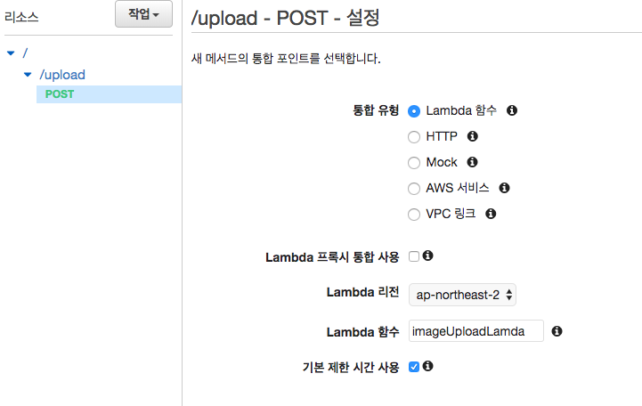

3. 권한 추가 창이 뜨면 확인 버튼 클릭
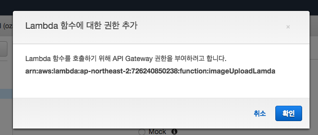

5. 통합 요청 클릭


6. 하단 본문 매핑 템플릿 드롭다운 선택

7. multipart/form-data 추가 후 클릭

8. 패스스루 동작변경 창이 뜨면 예 버튼을 클릭합니다.
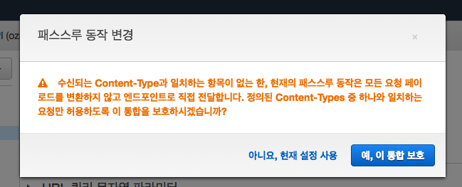

9. '템플릿 생성'에서 메서드 요청 패스스루 클릭 뒤 우측 하단 저장을 클릭합니다.
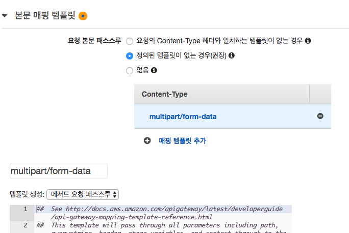

10. 작업탭에서 api 배포 선택

11. 새스테이지 / dev /develop 입력 뒤 배포 버튼 클릭
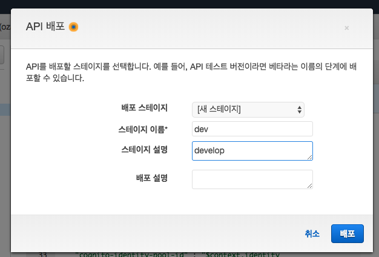

11. 스테이지에 있는 초록색 POST 글씨를 클릭하여 호출 URL을 복사합니다.
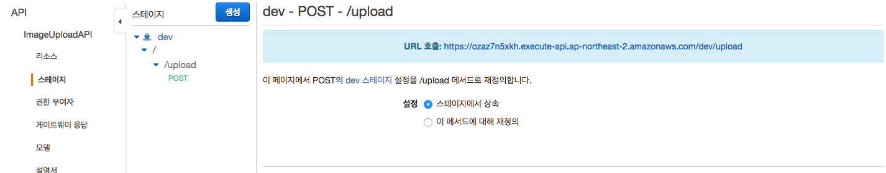

12. POSTMAN을 실행합니다.

13. 메서드 - POST
14. URL - 엔드포인트
15. Headers - Content-Type: multipart/form-data
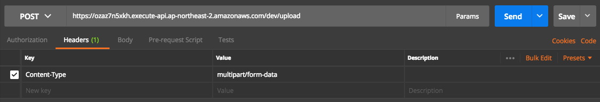
16. Body - form-data을 선택한뒤 Key에 image 입력
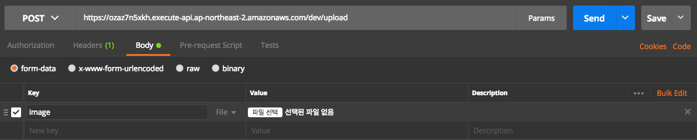

17. Send 버튼을 클릭하고 응답메세지를 확인
