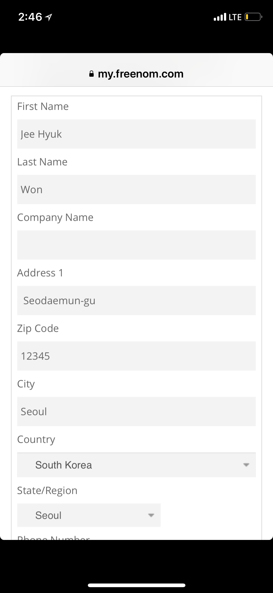
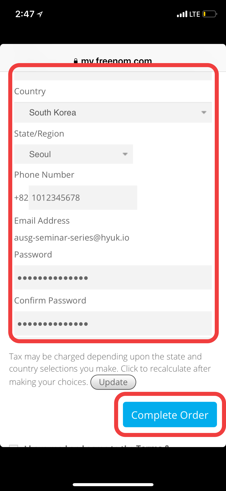

# Chapter 1. 학습 목표
- [Freenom](http://www.freenom.com/en/index.html?lang=en)을 통해 무료 도메인을 신청한다.
- 내 도메인으로 된 이메일을 수신하기 위해 Mailgun 가입 후 Freenom을 통해 신청한 무료 도메인을 Mailgun에 등록한다

# Freenom 가입 및 무료 도메인 생성

1. Freenom 사이트로 이동 [이동하기](http://www.freenom.com/en/index.html?lang=en)
[스크린샷]
2. 가운데 'Find a new FREE domain' 에 원하는 도메인 이름 입력
3. 'Check Availability' 클릭
[스크린샷]
4. 원하는 도메인의 'Get it now!' 클릭
5. 우측 상단 'Checkout' 클릭
[스크린샷]
6. 기본 설정 그대로 우측 하단 'Continue' 클릭
[스크린샷]
7. 좌측 하단 'Enter Your Email Address'에 나의 이메일 입력후, 'Verify My Email Address' 클릭 (참고: Captcha 창이 뜹니다.)
8. (Review & Checkout 창이 뜹니다.) 입력한 이메일 주소로 확인 메일이 전송되었습니다. 확인해주세요.
9. 받은 이메일에 포함된 링크를 클릭합니다.

10. 링크를 클릭하면, 회원가입 페이지로 이동합니다. 해당하는 정보를 다음 예제를 참고하여 차례대로 입력하세요. (예제따라 대충 입력하셔도 괜찮습니다)
11. 'I have read and agree to the Terms & Conditions'에 체크합니다
12. 'Complete Order' 클릭
13. 'Order Confirmation'이 나오면 신청이 완료 된 것입니다.

# Mailgun 가입 및 도메인 등록
1. Mailgun 사이트로 이동 [이동하기](https://www.mailgun.com/)
2. 우측 상단 'SIGN UP' 클릭
[스크린샷]
3. 예제를 참고하여 작성해주세요 (해외 결제 카드가 필요합니다)
4. -- 클릭
5. 입력한 이메일 주소로 확인 메일이 전송되었습니다. 확인해주세요.
6. 받은 이메일에 포함된 링크를 클릭합니다.
7. 휴대폰 번호를 입력합니다.
8. -- 확인코드 입력 (??? - 해당 휴대폰 번호로 이미 등록되어 있다면 진행 불가)
9. Mailgun 메인 페이지로 이동합니다 [이동](https://app.mailgun.com/app/dashboard)
10. 좌측 상단의 'Domains'를 클릭합니다
11. 'Add New Domain'을 클릭합니다
[스크린샷]
12. 아까 등록한 도메인을 적습니다 (subdomain은 적지 않습니다 - Warning 오류는 무시하세요)

### 축하드립니다. 이제 모든 준비가 끝났네요! Chapter 2. [Route 53 Hosted Zone 등록 (Mailgun을 이용해 내가 등록한 도메인으로 메일 받아보기)](../2_route53/)로 이동하세요.