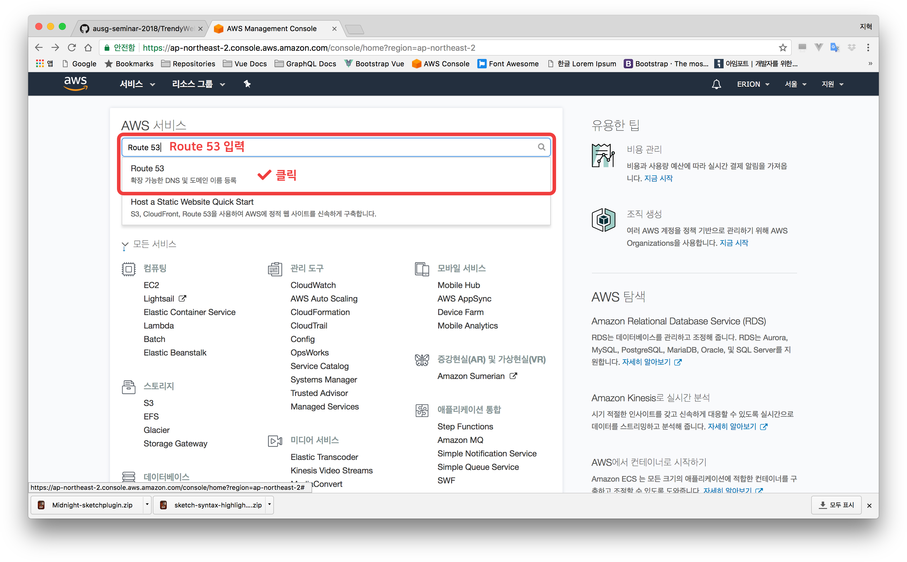
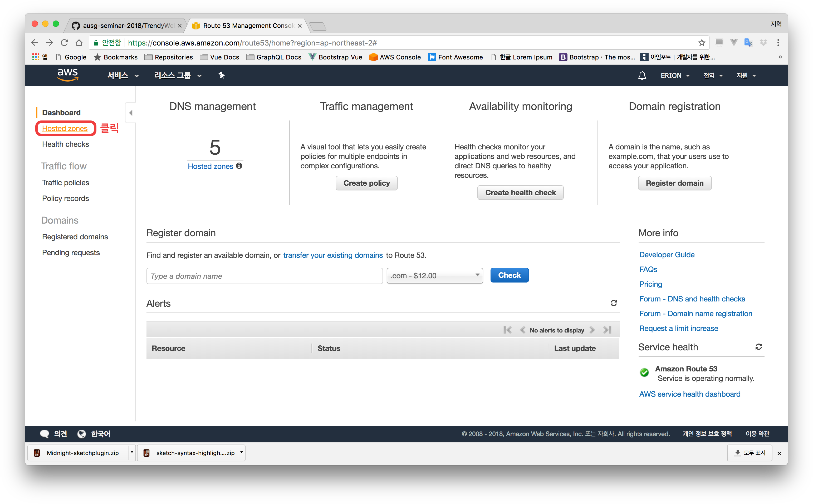
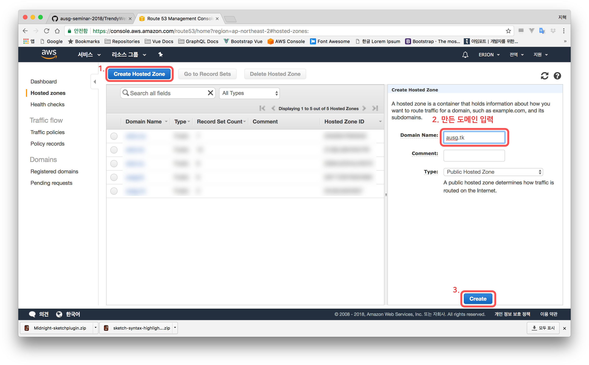
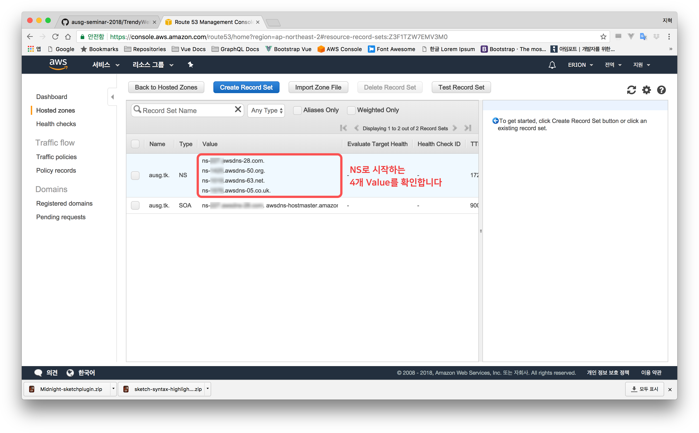
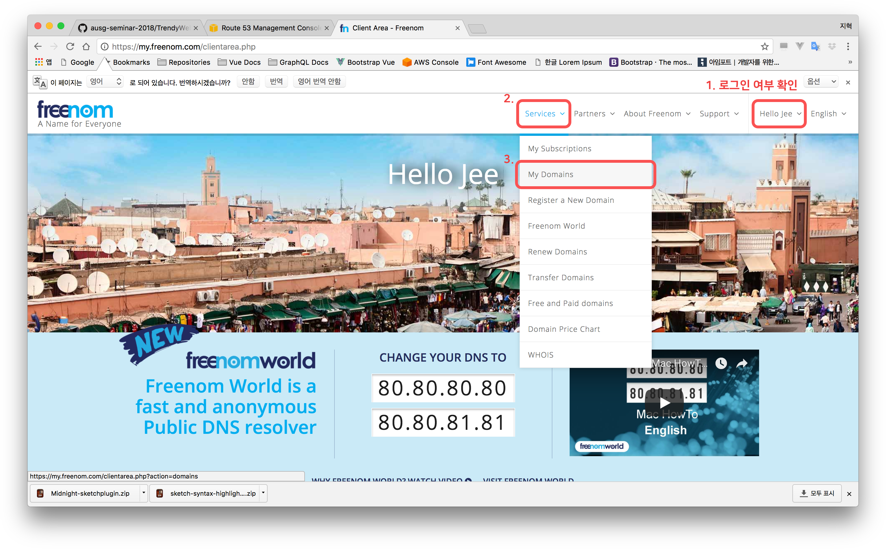
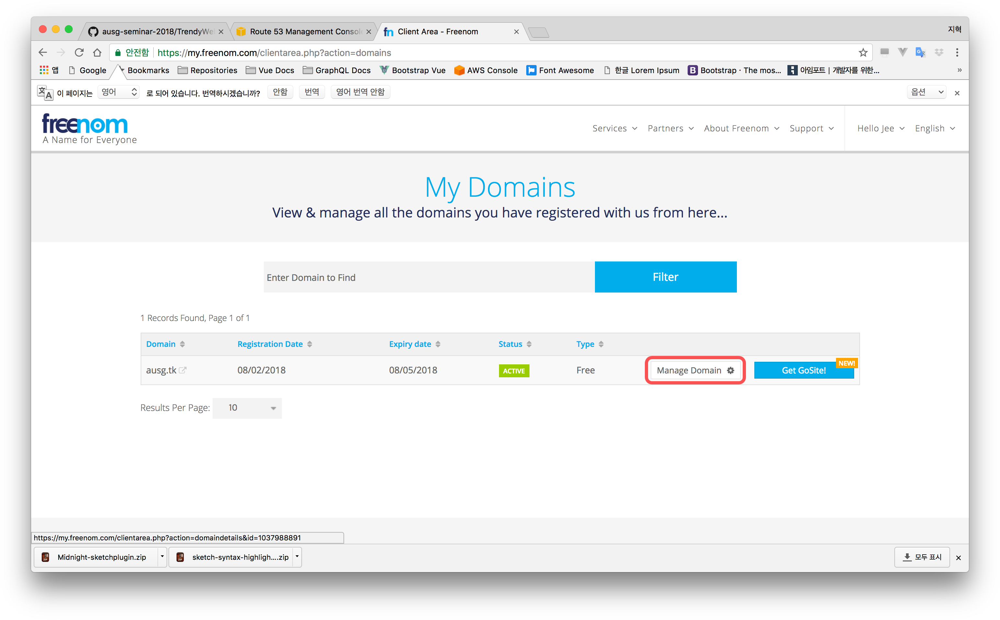
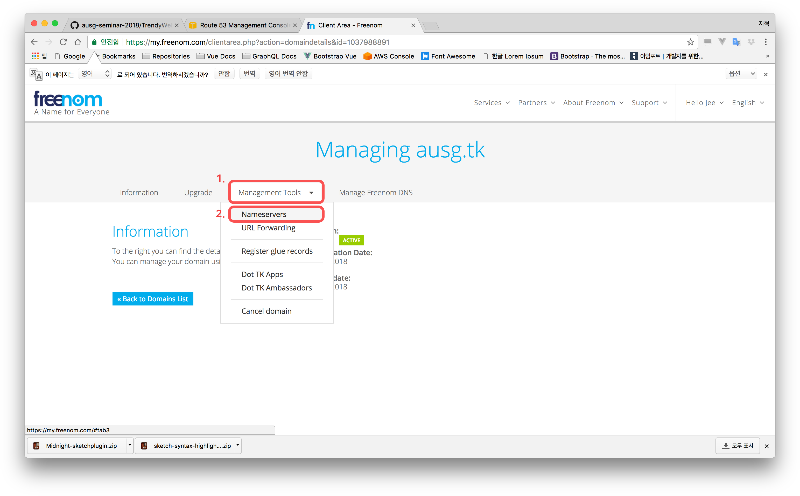
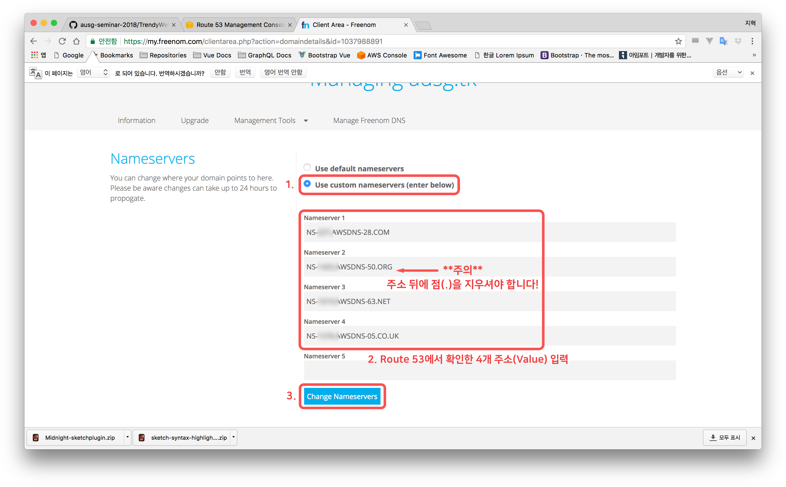

# Chapter 2. 학습 목표
- Route 53에 새로 만든 도메인을 등록한다.
- Route 53을 이용해 새로 만든 도메인으로 요청되는 Mail 관련 서비스를 Mailgun으로 포워딩한다.

# Route 53에 도메인 등록
- AWS Console로 이동
- Route 53 서비스로 이동

- 좌측 메인 메뉴에서 'Hosted zones' 클릭

- 상단 'Create Hosted Zone' 클릭
- 우측에 메뉴가 나옵니다. Domain Name에 만든 도메인을 입력합니다
- 다른 옵션은 건드리지 않고 하단의 'Create' 버튼을 클릭합니다
- (생성된 Hosted Zone으로 바로 이동됩니다)

- 레코드 중 Type이 NS이 레코드의 Value를 확인합니다.

- Freenom으로 이동 한 뒤 전에 만든 계정으로 로그인합니다
- 상단의 메뉴에서 'Services' - 'My Domains'로 들어갑니다

- 만들어진 도메인의 'Manage Domain'을 클릭합니다

- 'Management Tools' - 'Name Servers'를 클릭합니다

- 아까 확인한 Value 4개를 차례대로 입력합니다
- 'Change Nameservers' 클릭

- 축하합니다! 해당 도메인을 이제 Route 53을 통해 관리 할 수 있습니다.

# Mail 관련 서비스를 Mailgun으로 포워딩
- Mailgun으로 이동
- [Mailgun] 상단의 'Domains' 클릭
- [Mailgun] 목록에서 아까 만든 Domain Name을 클릭합니다
[스크린샷]
- [Mailgun] 하단의 'Domain Verification & DNS' 클릭
- [Mailgun] 값들을 모두 확인합니다
- [Route53] Route 53 서비스로 이동합니다. (Hosted Zone 페이지)
- [Route53] 상단 'Create Record Set' 클릭
[스크린샷]
- [Route53] Mailgun의 'Type', 'Hostname', 'Enter this Value'를 참고하여 적어줍니다. (예제를 참고하세요)
	- MX 부분 주의
- [Mailgun] 'Check DNS Records Now' 클릭 - 시간이 조금 걸릴 수 있습니다
- [Mailgun] 상단의 'Routes' 클릭
- [Mailgun] Create New Route 클릭
[스크린샷]
- Actions의 Forward를 체크 한 뒤 포워딩 된 메일을 받을 이메일 주소를 입력해주세요
- 'Create Route' 클릭
- 메일이 잘 오는지 확인 (포워딩에 등록한 이메일 말고 다른 메일로 보내셔야 받을 수 있습니다. 주변 분들께 도움을 구하세요!)

### 축하드립니다. 이제 신청하신 도메인으로 이메일 서비스를 이용 하실 수 있습니다. Chapter 3. [S3 정적 웹사이트 호스팅](../3_s3/)로 이동하세요.