# Chapter 3. S3 정적 웹사이트 호스팅
### 학습목표
- S3에 정적 파일을 업로드한다
- 정적 파일 호스팅 기능을 이용해 우리가 만든 도메인에 연결해본다

# 정적 HTML 파일 업로드
- AWS Console로 이동
- S3 서비스로 이동

- '버킷 만들기' 클릭
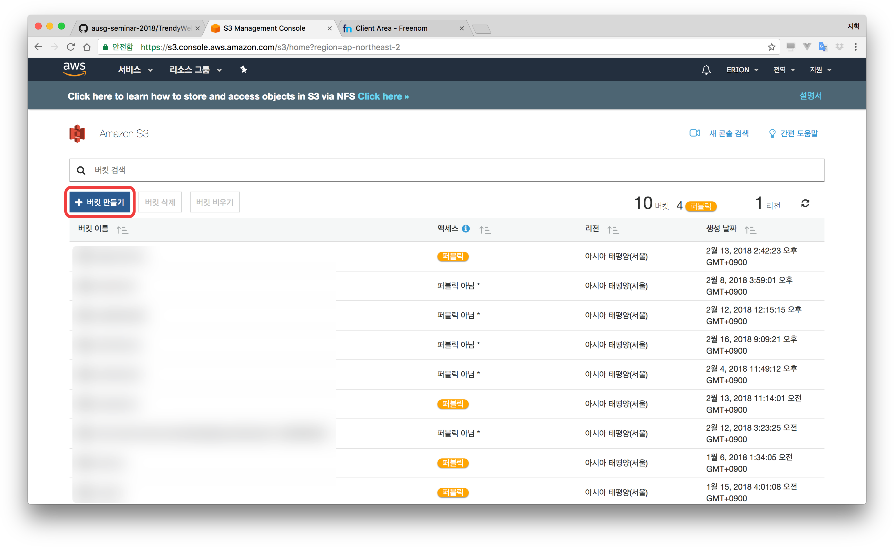
- 팝업 창이 뜨면, '버킷 이름'에 **우리가 만든 도메인 주소**를 입력합니다.
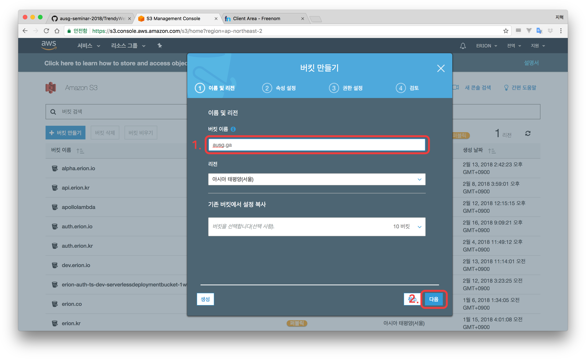
- 모든 설정을 기본 설정 값으로 두고 '다음' 클릭 (두 번)
- '버킷 만들기' 클릭
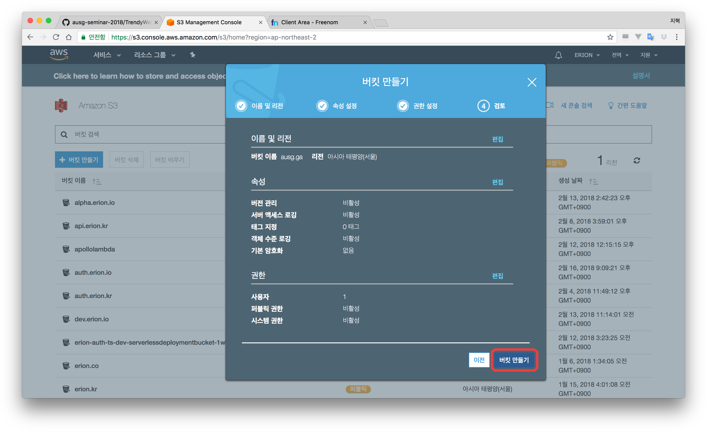
- 만든 버킷을 클릭합니다
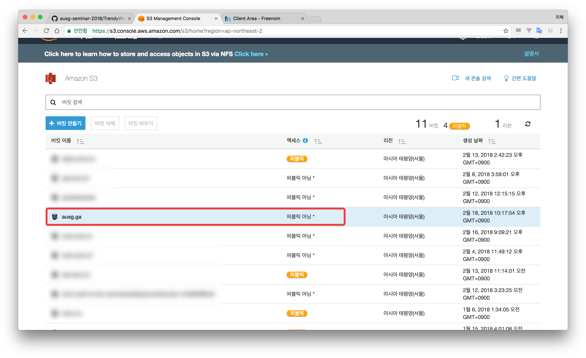
- '속성' 클릭
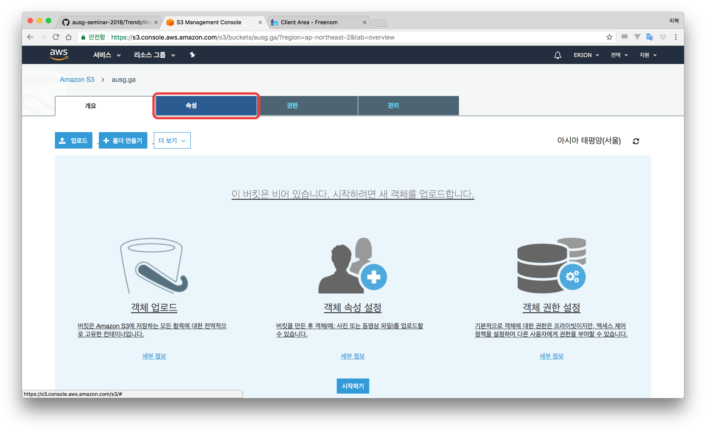
- '정적 웹사이트 호스팅' 클릭
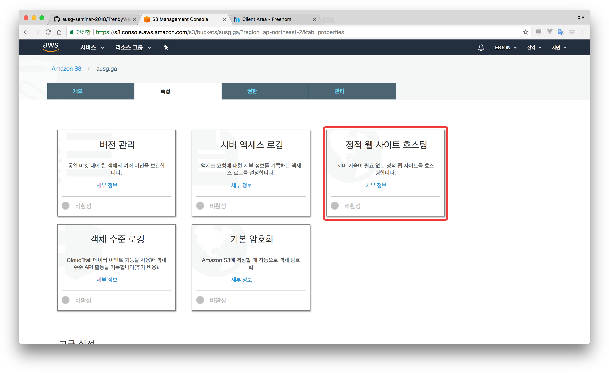
- '이 버킷을 사용하여 웹 사이트를 호스팅합니다.' 클릭  
- 인덱스 문서와 오류 문서에 index.html을 적어줍니다.
	> [오류 문서에 index.html을 적어주는 이유] 우리가 뒤에 만들 Single Page Application는 도메인뒤에 어떠한 주소가 오던지 상관없이 오직 index.html 파일만 출력해야 합니다. S3 정적 웹사이트 호스팅에서는 해당 URL에 파일이 없는 경우에 '오류 문서'를 보여주게 되는데, 여기에 index.html을 적게되면, 도메인 뒤로 어떤 주소가 오게 되던지 index.html을 응답으로 받을 수 있습니다.
- '저장' 클릭
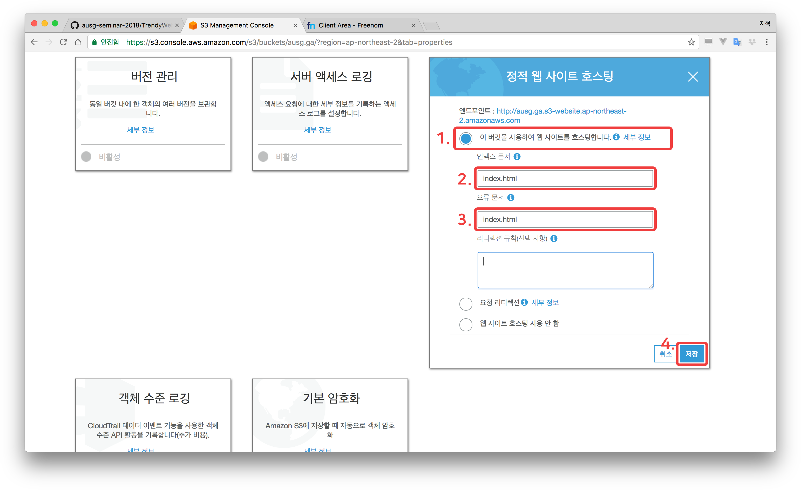
- '권한' 클릭  
- '버킷 정책' 클릭

```json
{
  "Version": "2012-10-17",
  "Statement": [
    {
      "Effect": "Allow",
      "Principal": "*",
      "Action": "s3:GetObject",
      "Resource": "arn:aws:s3:::여기에.도메인.입력/*"
    }
  ]
}
```

위의 값을 복사, 붙여넣기 해주신 후 버킷 생성시 입력한 도메인을 넣어주세요
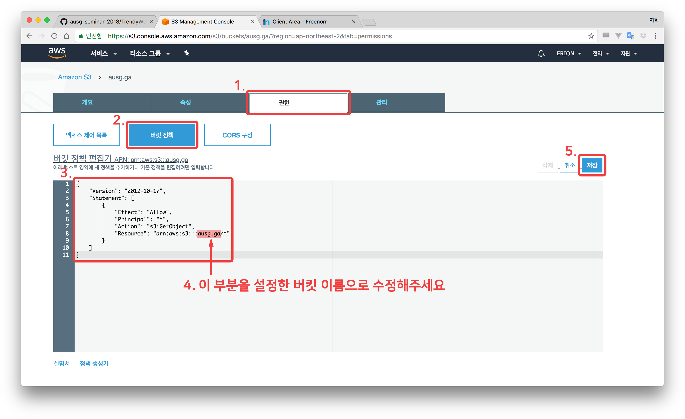

- 이제 호스팅에 필요한 S3 설정은 모두 끝이 났습니다. 이제 index.html 파일을 업로드 해봅시다
- (처음으로 돌아갑니다) '개요' 클릭
- '업로드' 클릭

- '파일 추가' 클릭 후 index.html 선택 후 '업로드' 클릭
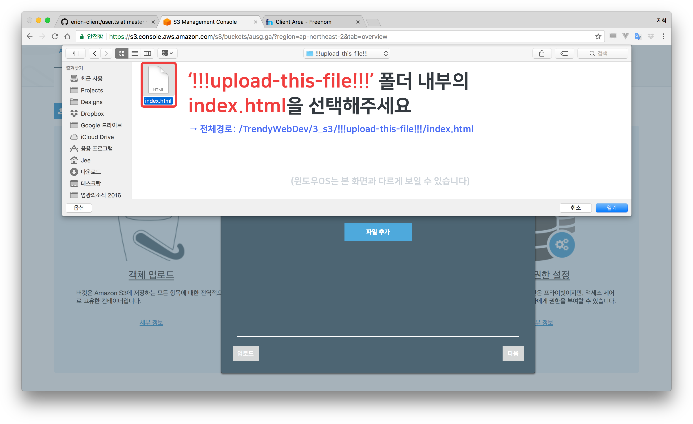
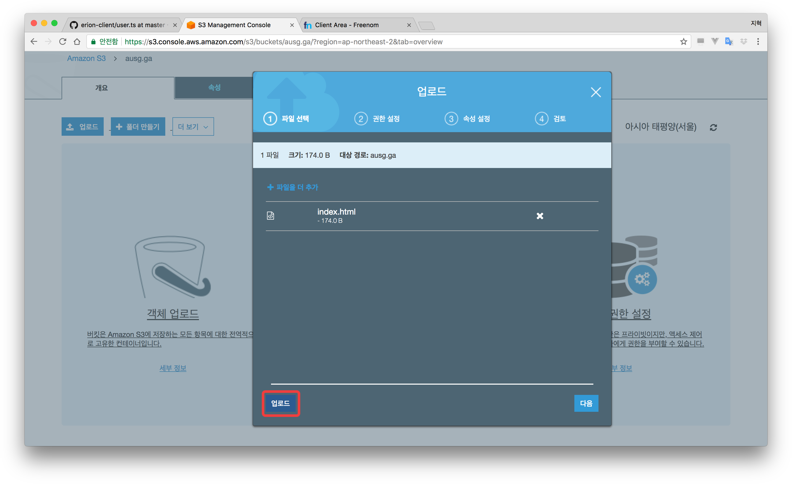
- index.html을 업로드 했으면 방금 전 '속성' → '정적 웹사이트 호스팅' 에서 확인했던 엔드포인트 주소로 접속해 결과를 확인해봅니다.
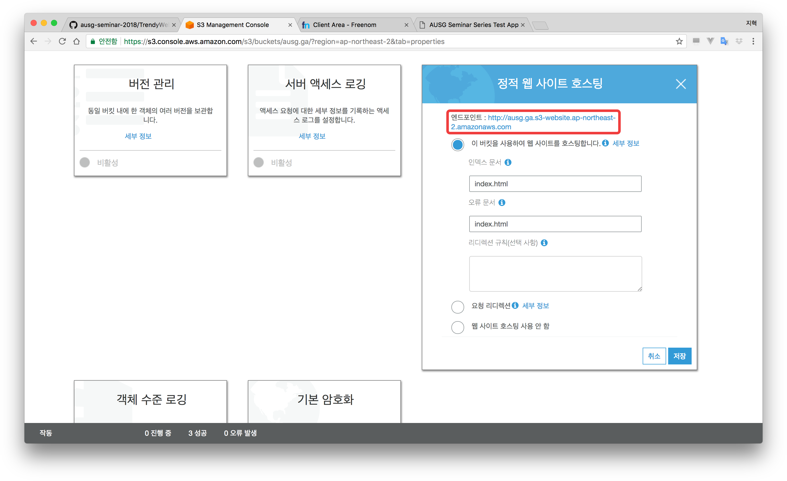
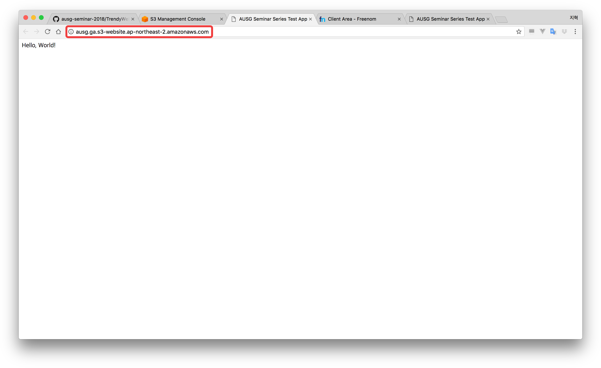


# Route 53을 사용해 내 도메인에 S3 버킷 연결
- AWS Console로 이동 
- Route 53 서비스로 이동
- Hosted Zone으로 이동 후 아까 등록한 도메인 클릭  
- 'Create Record Set' 클릭
- Name을 비워놓습니다
- Alias 항목 'Yes' 체크
- 'Alias Target'을 클릭해 커서를 활성화합니다
- 잠시 기다리면 (꽤 시간이 소요됩니다), - S3 website endpoints - 에 만든 S3 버킷이 나옵니다. 해당 버킷을 선택합니다
- 'Create'를 클릭합니다
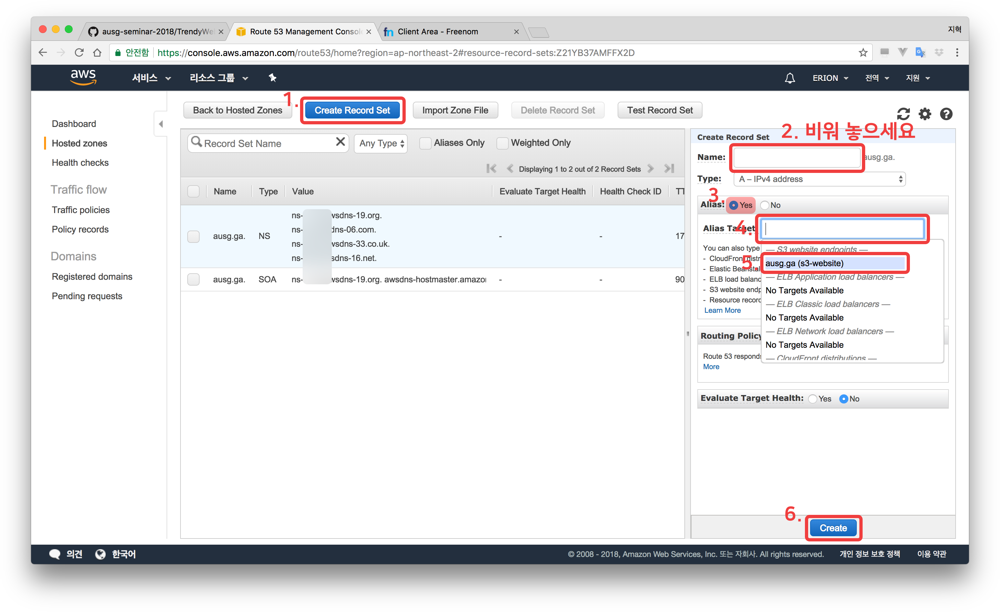
- 잠시 기다리면 (DNS가 퍼지는 동안 시간이 소요됩니다), 도메인을 통해 S3 정적 웹사이트에 접근이 가능합니다.
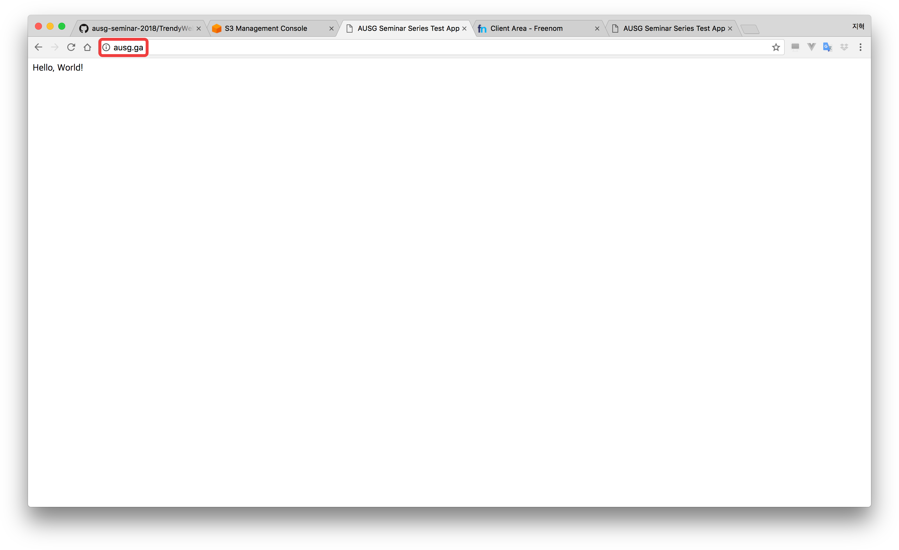

### 축하드립니다. 이제 신청하신 도메인으로 HTML 파일을 호스팅 할 수 있습니다. Chapter 4. [HTTPS 호스팅을 위해 HTTPS 인증서 만들기](../4_certification_manager/)로 이동하세요.