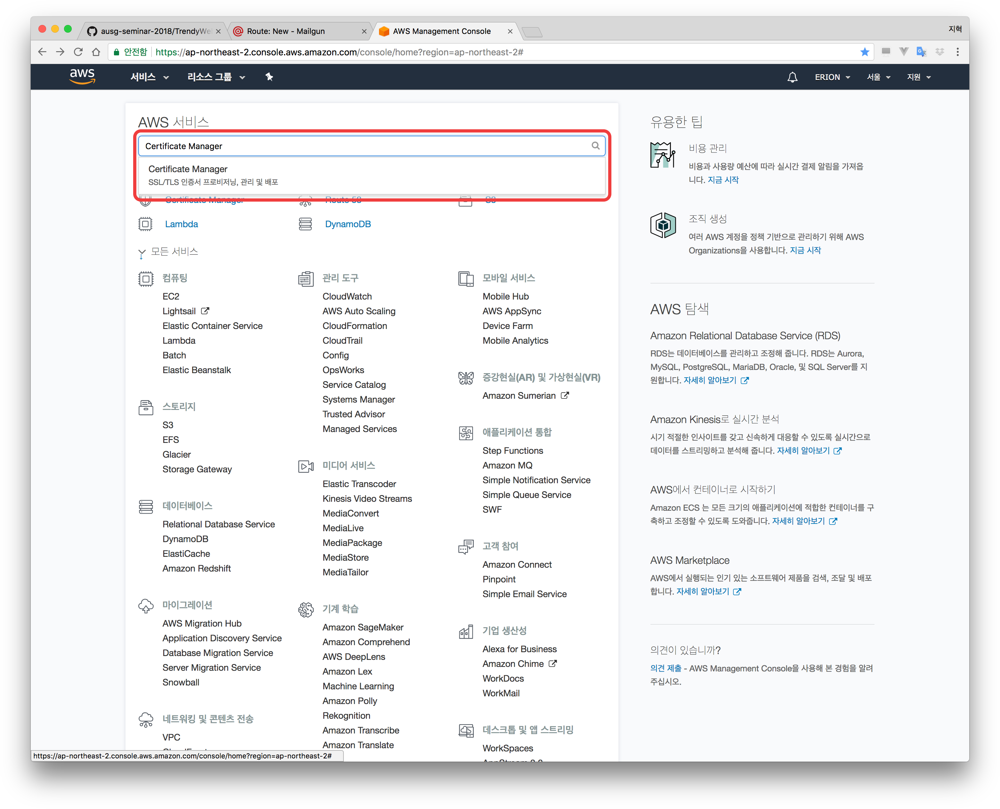
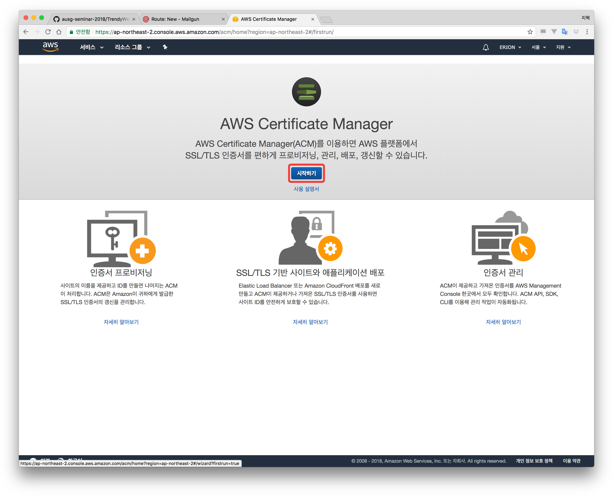
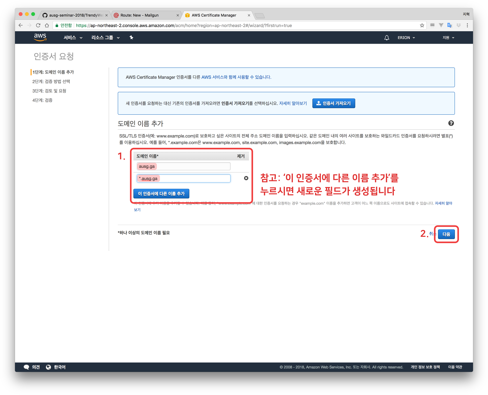
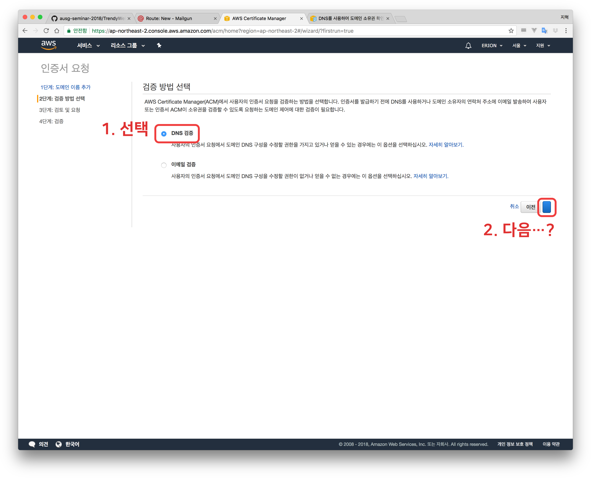
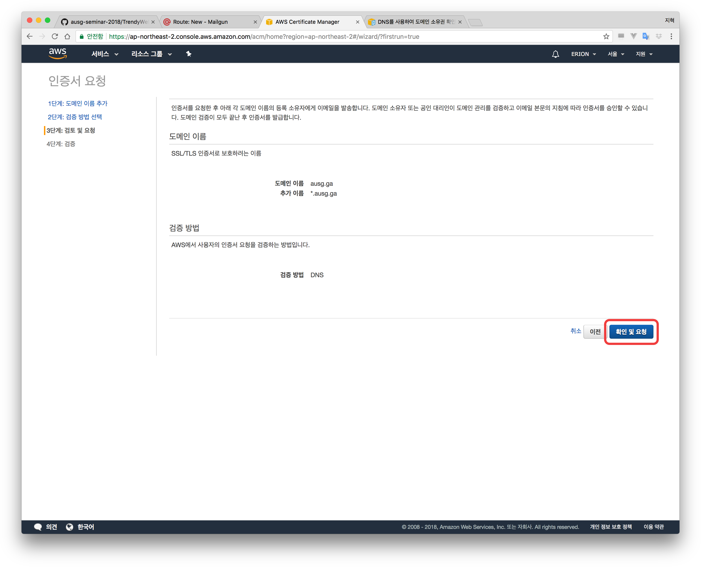
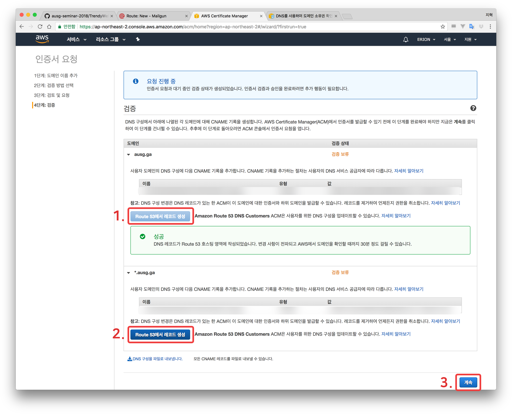
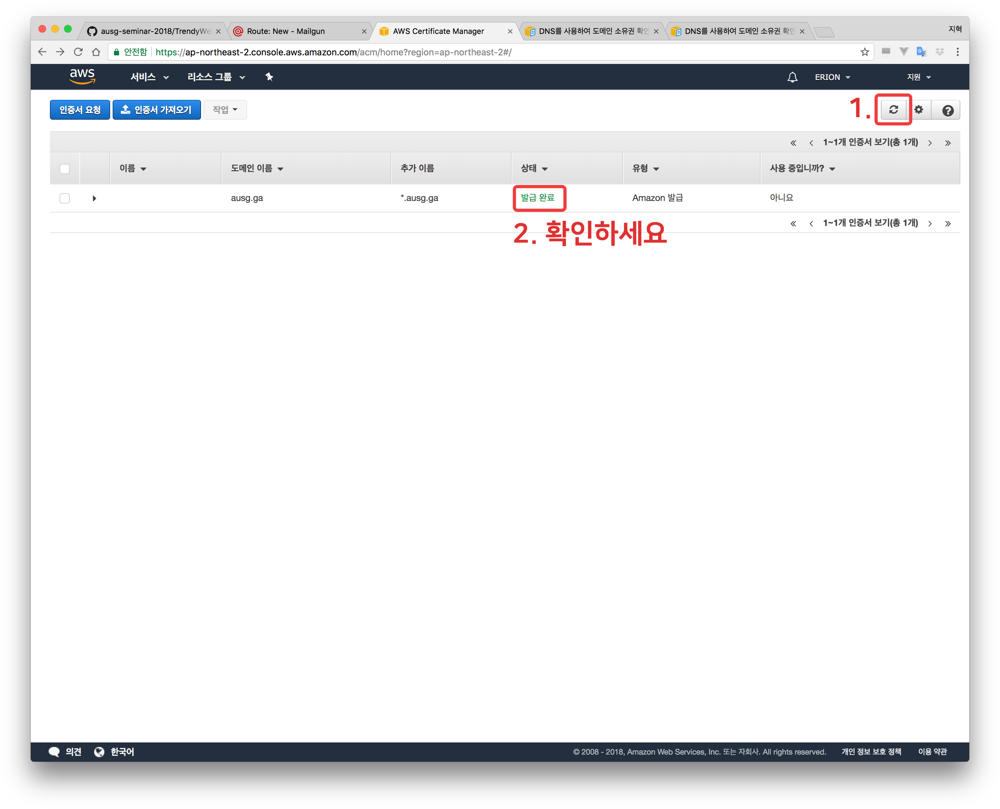

# Chapter 4. Certification Manager로 인증서 만들기
### 학습목표
- AWS Region에 대해 이해한다
- 인증서를 발급한다

# Certification 받기
- AWS Console로 이동
- Certification Manager로 이동

- '시작하기' 클릭

- 도메인 이름에 `*.내도메인.이름`, `내도메인.이름` 두 개를 입력합니다
- '다음'을 클릭합니다

- 'DNS 검증'을 선택합니다
- '다음'...? 버튼을 클릭합니다.

- '확인 및 요청' 버튼을 클릭합니다.

- 'Route 53에서 레코드 생성' 버튼을 차례대로 클릭합니다.

- 메인 페이지에서 새로고침 버튼을 누르고 '상태'를 다시 확인합니다.

### 축하드립니다. HTTPS 인증서를 발급 받으셨습니다. Chapter 5. [CloudFront로 CDN 구성하기](../5_cloudfront/)로 이동하세요.