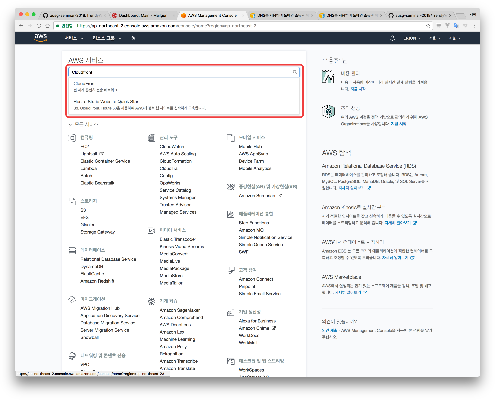
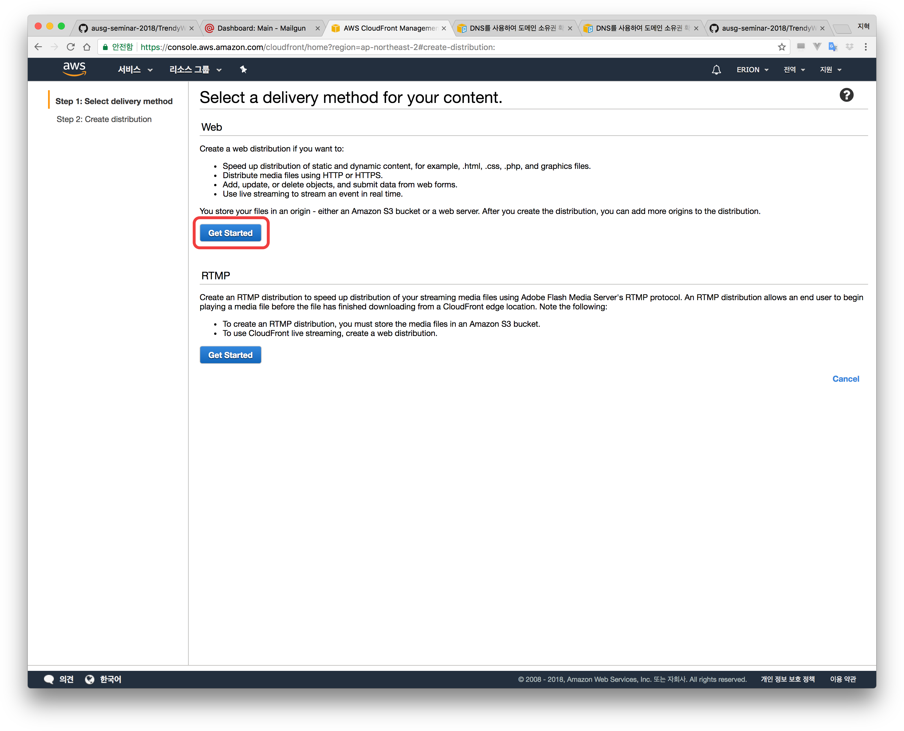
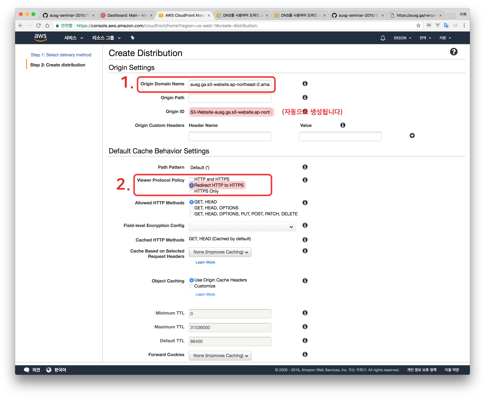
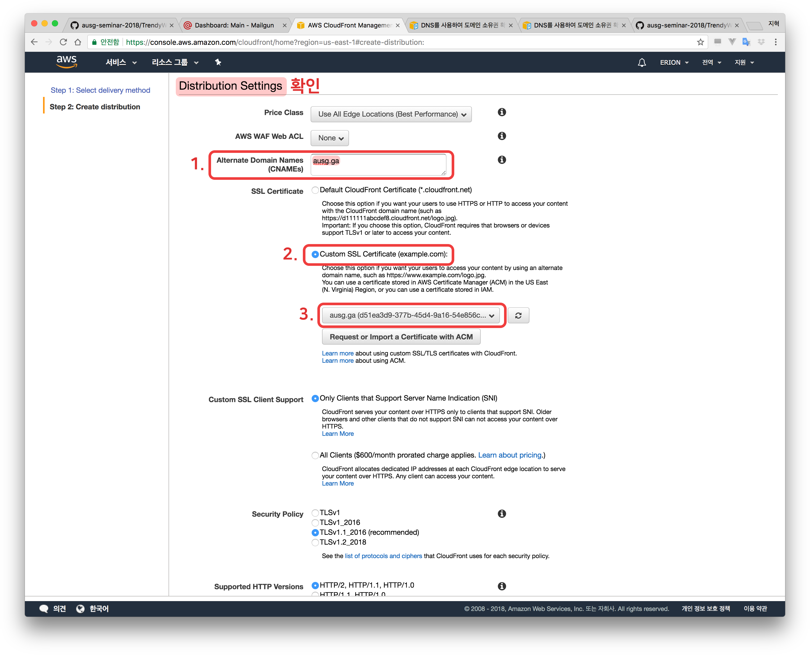
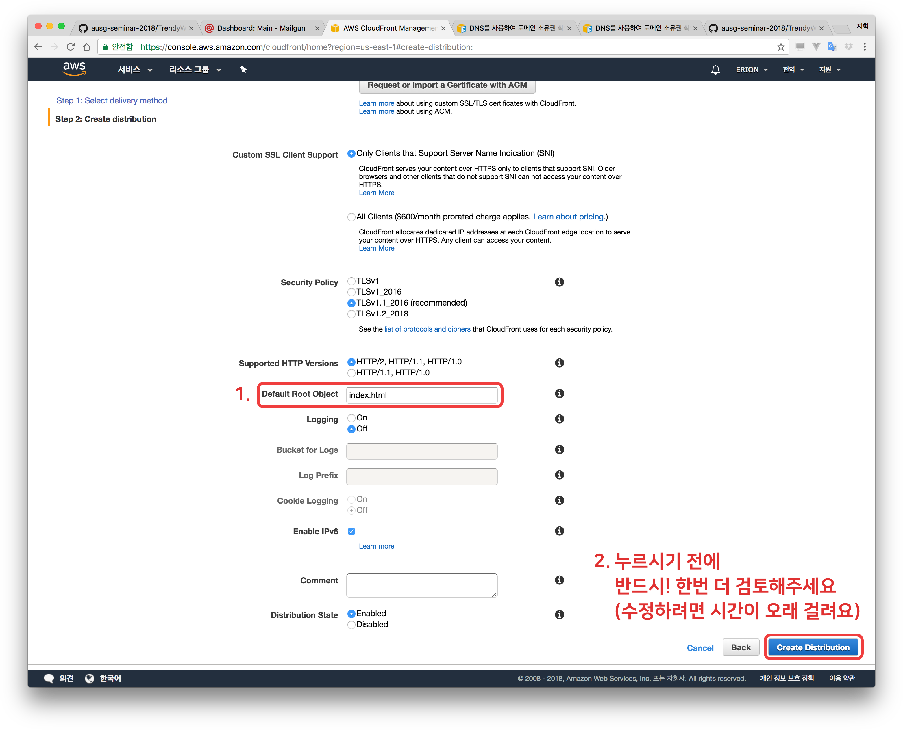
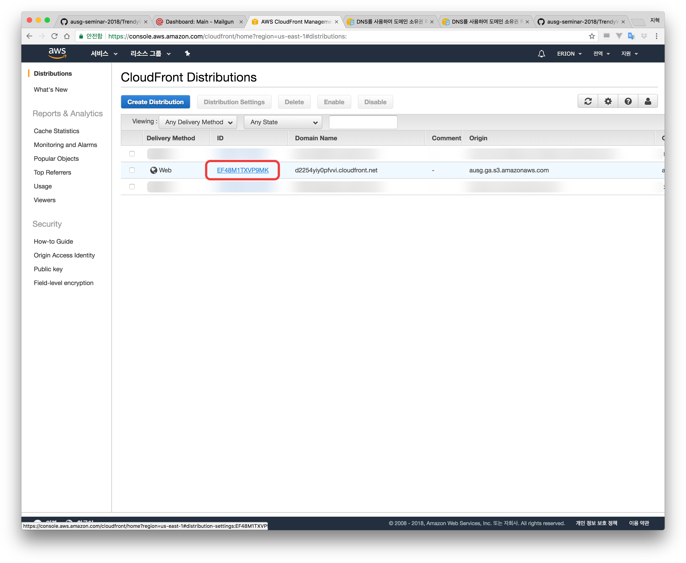
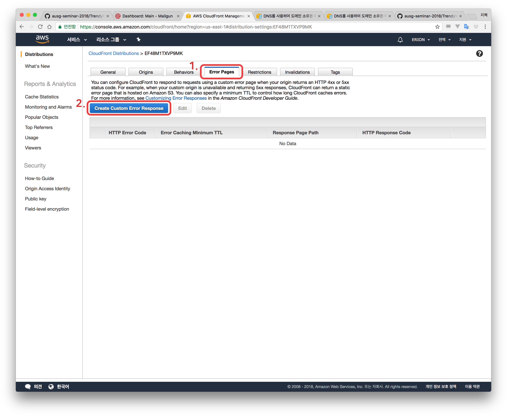
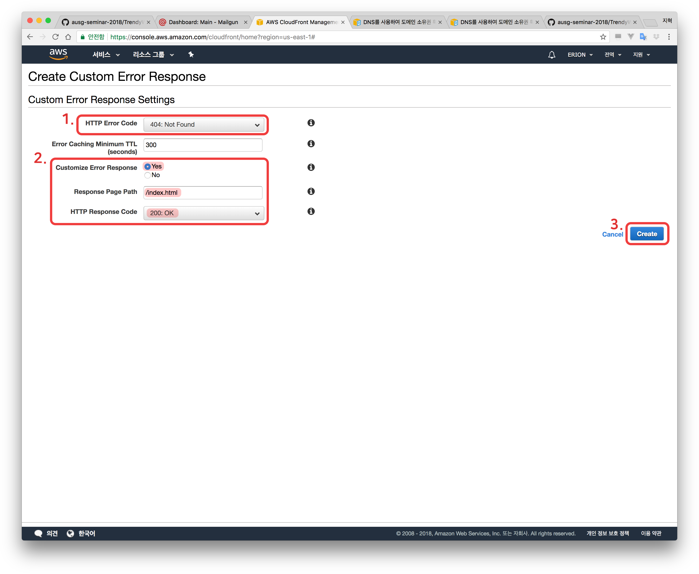
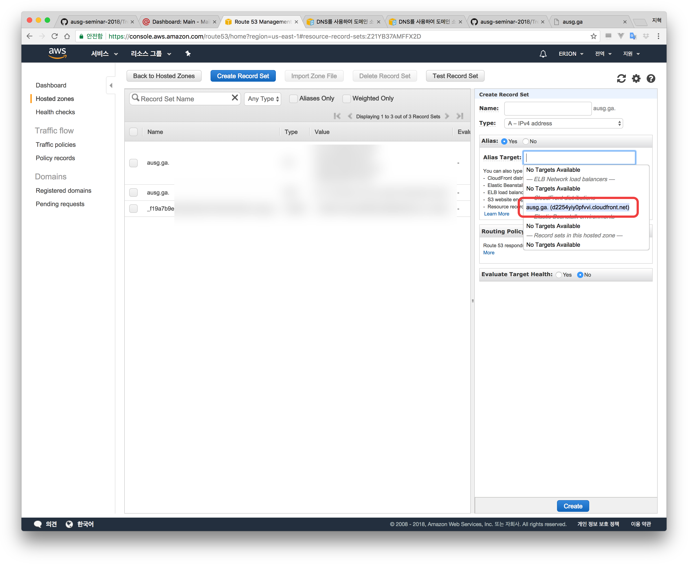

# Chapter 5. CloudFront로 CDN 구성하기
### 학습목표
- 우리가 만든 정적 웹사이트를 HTTPS로 호스팅한다

# CloudFront로 S3 정적 웹사이트를 CDN을 통해 HTTPS로 제공해보기
- AWS Console로 이동합니다
- CloudFront로 이동합니다

- 'Create Distribution' 클릭

- Web으로 'Get Started' 클릭

- 예시를 활용해 설정값을 입력합니다
- 'Origin Domain Name'에서 S3 버킷의 '정적 웹호스팅 엔드포인트'를 넣어주세요

### 절대 클릭해서 선택하시면 안됩니다!!!

- 'Viewer Protocol Policy'를 'Redirect HTTP to HTTPS'로 변경해줍니다

- 'Alternate Domain Names (CNAMEs)'를 `내도메인.이름`으로 바꿔줍니다
- 'SSL Certificate'를 'Custom SSL Certificate (example.com)'으로 변경하고, 방금 Certification Manager에서 생성한 인증서를 선택합니다.

- 'Default Root Object'에 `index.html`을 입력합니다

### CDN이 퍼지기까지 시간이 꽤 많이 걸립니다. 입력한 값들을 !!!!반드시!!!! 다시 한 번 확인해주세요.

- 'Create Distribution'을 클릭하세요.

# Error 페이지 커스터마이징
- 만들어진 Distribution을 클릭합니다

- 'Error Pages'를 클릭합니다.
- 'Create Custom Error Response'를 클릭합니다.

- 'HTTP Error Code'를 '404: Not Found'로 설정합니다
- 'Customize Error Response'를 'yes'로 설정합니다
- 'Response Page Path'에 `/index.html`를 입력합니다
- 'HTTP Response Code'를 '200: OK'로 설정합니다
- 'Create'를 클릭합니다.

# 내 도메인과 CloudFront 붙이기 (Route 53)
- AWS Console로 이동합니다
- Route53으로 이동합니다
- 전에 만든 Hosted Zone으로 이동 한 뒤
- 'Create Record Set' 클릭
- 'Alias'를 'Yes'로 바꿔줍니다
- 'Alias Target'에 만들어준 'CloudFront distributions'을 선택합니다

- 'Create' 를 클릭합니다

### 축하드립니다. 우리 앱이 HTTPS로 인터넷에 공개되었습니다. CDN이 퍼지는 동안 시간을 좀 보내볼까요? Chapter 6. [Vue.js 소개](../6_vue/)로 이동하세요.
