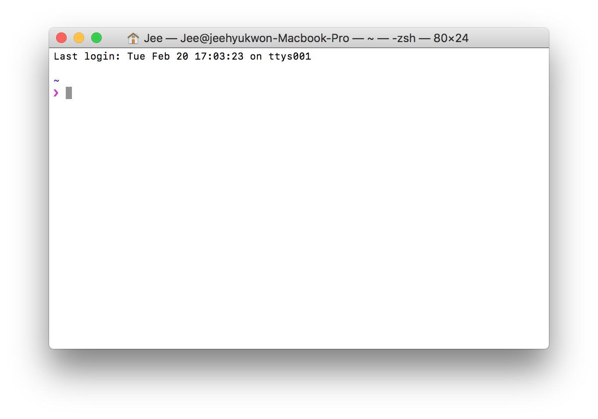
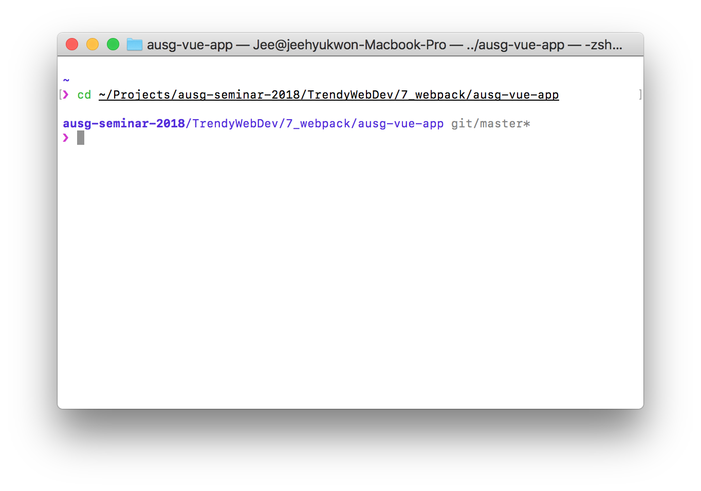
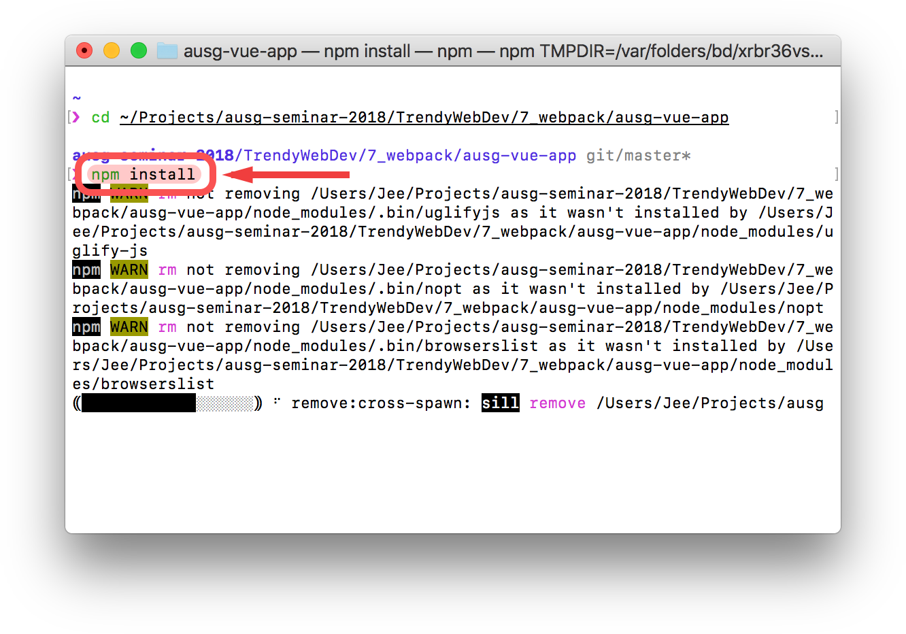
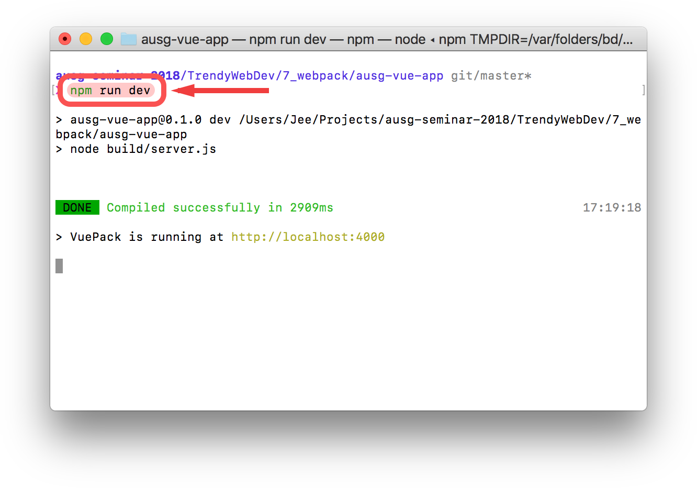
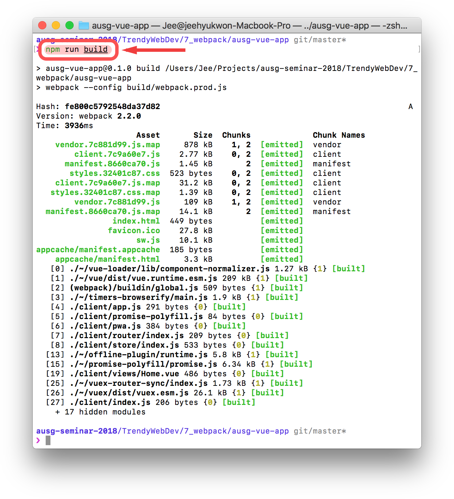

# Chapter 7. Webpack 소개 및 배포 자동화
### 학습목표
- Webpack의 역할에 대해 이해한다
- IAM 역할, 정책, 사용자, 그룹에 대해 이해한다
- CLI를 사용해 S3 Bucket에 만들어진 HTML, CSS, JS 파일을 배포해본다

# 1. 컴포넌트가 여러개??
  - 자바스크립트(브라우저)는 원래 모듈을 지원하지 않음
  - require 소개
  - import / export (ES6) 소개
  - npm 소개
  - Webpack이란? (개념)
  - 본격적으로 Vue Project 시작해보기 (Vue CLI로 Scaffolding)
> [참고] 본 세션에서는 Vue CLI와 함께 `egoist/vuepack` 템플릿을 사용합니다.
  
> 현재(2월 22일 기준) Vue CLI는 3.0-alpha가 최신입니다. (TypeScript를 사용하실 예정이라면, Vue CLI 3을 사용하시는 것을 추천합니다)

# 2. 실습 (지금부터 AWS Console이 아닌 Local에서 작업하셔야 합니다.)
- [주의] 스크린샷과 보이는 모습이 다를 수 있습니다.
- macOS 환경이신 경우 `Terminal.app`, Windows 환경이신 경우 `cmd`를 열어주세요.

- `/TrendyWebDev/7_webpack/ausg-vue-app`으로 이동합니다 (`cd` 명령어를 이용하세요)

- `npm install`을 입력해주세요 (반드시 Node.js가 설치되어 있어야 합니다)
> `npm install` 명령어는 해당 폴더내에 `package.json`에 포함된 모든 필요한 패키지를 `node_modules` 폴더에 설치합니다. 

> [참고] 저는 `npm` 대신 `yarn`을 사용합니다. 고양이가 귀엽거든요! (두 개의 차이점은 거의 없다고 보시면 됩니다)

- 설치가 완료되면 해당 폴더를 코드 에디터(Atom, VS Code 등)으로 열어봅니다.
- 폴더 구조 설명
  - `build` 폴더 안에는 빌드를 위해 필요한 Webpack 설정이 들어있습니다
  - `client` 폴더 안에는 우리가 앱을 제작할 소스가 들어있습니다.
  - `node_modules` 폴더 안에는 NPM 패키지들이 들어있습니다.
  - `static` 폴더 안에는 정적으로 호스팅 할 이미지 등을 넣으시면 됩니다.
- 먼저 한번 어떤 앱인지 확인해볼까요? `npm run dev`를 입력하시면 자동으로 개발 서버를 띄웁니다.
> 참고) `npm run *` 명령어는 `package.json` 파일 내부에 `scripts` 속성에 가시면 새롭게 정의하거나 수정 할 수 있습니다.

- 성공하셨나요? 그렇다면, `http://localhost:4000`으로 이동해봅니다. [이동](http://localhost:4000)
> 참고) 이 개발 서버는 수정 사항이 있을 때마다, 자동으로 새로고침 해줍니다.

- 수정 진행... (준비중)

- 이제 빌드 해보겠습니다. `npm run build` 명령어를 입력하시면 우리의 앱을 html, css, js 파일로 이루어진 정적 파일로 빌드해줍니다.

- 빌드가 끝나셨으면, `dist` 폴더가 생긴 모습을 확인 할 수 있는데요, 이 폴더 내부에 정적 파일들이 저장됩니다.

# 3. Webpack Plugin으로 S3에 자동 업로드 해보기
  1. S3 Full Access 권한을 가진 IAM 계정 만들기
  2. Access Key, Secret Key 가져오기
  3. 그대로 넣어서 쉬운 배포 체험해보기