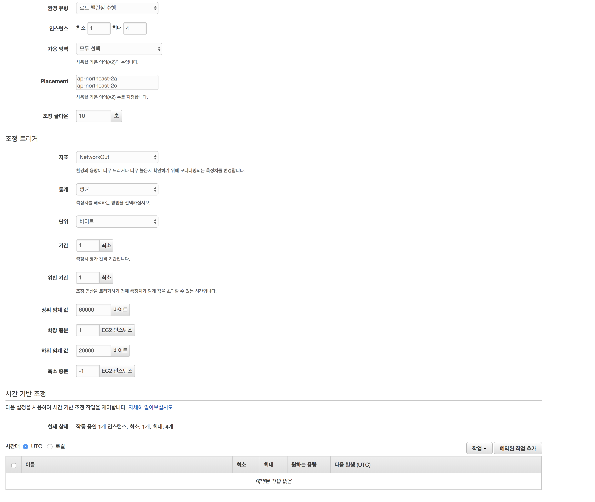

## Chapter 5. Elastic BeanStalk With C9
1. **c9 터미널에서** `pip install awsebcli --upgrade --user` 입력
2. **c9 터미널에서** `eb init --platform node.js --region ap-northeast-2` 입력
3. `c9only/ausg-seminar-2018/teamplay/helloc9`에 `.ebextensions` 디렉토리를 만든다
4. `c9only/ausg-seminar-2018/teamplay/helloc9/.ebextensions`에 `nodecommand.config` 파일 만들고 아래 내용 붙여넣기 후 
  저장
  ```
  option_settings:
    aws:elasticbeanstalk:container:nodejs:
      NodeCommand: "npm start"
  ```

  

5. **c9 터미널에서** `eb create node-express-env`
6. **c9 에디터에서** `c9only/ausg-seminar-2018/teamplay/helloc9/route/index.js`을 열기
- 다음의 내용을
```javascript
var express = require('express');
var router = express.Router();

/* GET home page. */
router.get('/', function(req, res, next) {
  res.render('index', { title: 'Hello C9' });
});

module.exports = router;
```

- 다음과 같이 변경합니다
```javascript
var express = require('express');
var router = express.Router();

/* GET home page. */
router.get('/', function(req, res, next) {
  res.render('index', { title: 'Hello Elastic BeanStalk With C9' }); // 'Hello C9'을 -> 'Hello Elastic BeanStalk With C9' 로 변경
});

module.exports = router;
```
7. **c9 터미널에서** `eb deploy`을 입력
8. [Elastic BeanStalk](https://ap-northeast-2.console.aws.amazon.com/elasticbeanstalk/home?region=ap-northeast-2#/welcome) 접속
9. 좌측 탭 **구성** 선택
10. **용량** 탭 선택
11. **조정 쿨다운** `10`초 입력
12. **조정 트리거** 탭에 **지표**를 **NetworkOut**로 선택
13. **통계** 탭에 **평균**을 선택
14. **단위** 탭에 **바이트**를 선택
15. **기간** 탭에 **1** 최소 입력 -> (1분동안 metric)
16. **위반 기간** 탭에 **1** 최소 입력 -> (if 1분 이상 위반하면 스케일링)
17. **상위** 탭에 임계 값 **60000** 바이트 입력
18. **확장 증분** 탭에 **1** EC2 인스턴수 입력 -> (1개씩 인스턴스 증가)
19. **하위 임계** 탭에 **20000** 바이트 입력
20. **취소 증분** 탭에 **-1** EC2 인스턴스 입력 -> (-1개씩 인스턴스 소멸)
21. **c9 터미널에서** `ab -n 500000 -c 200 http://엘라스틱 빈스톡 주소/`
22. **Elastic Beanstalk 웹 콘솔**의 상태 탭에서 Autoscale을 관찰함 (인스턴스가 2개 이상으로 늘어나는지)



실습이 완료되면 다음모듈인 [Chapter 6. 삭제 가이드](../6_removeGuide/) 으로 이동하십시오
