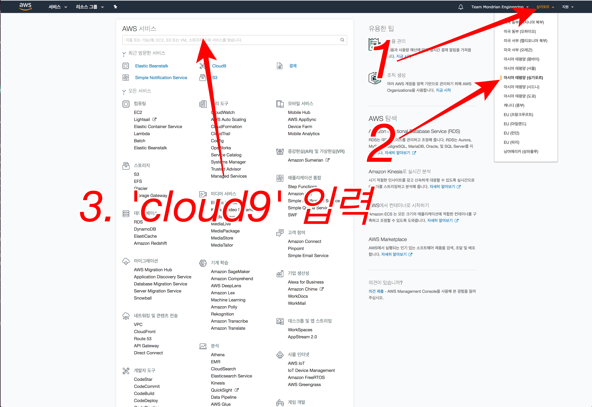
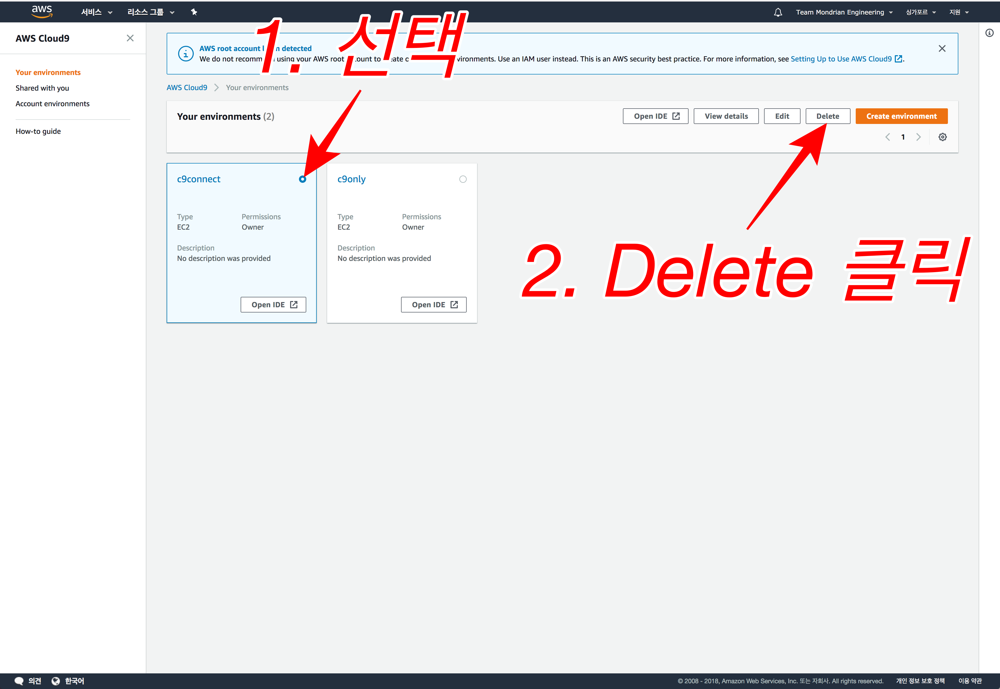
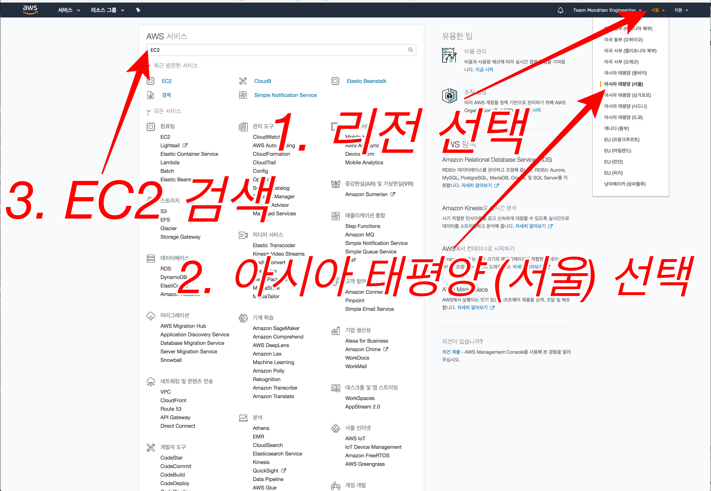
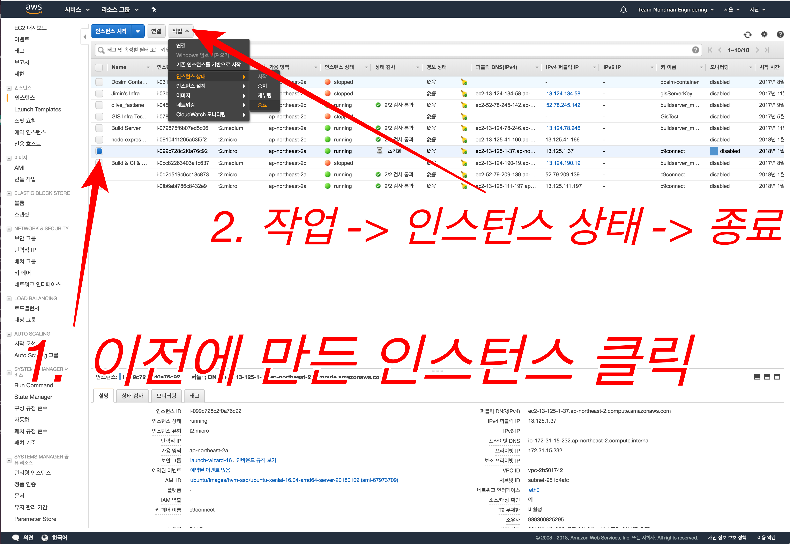
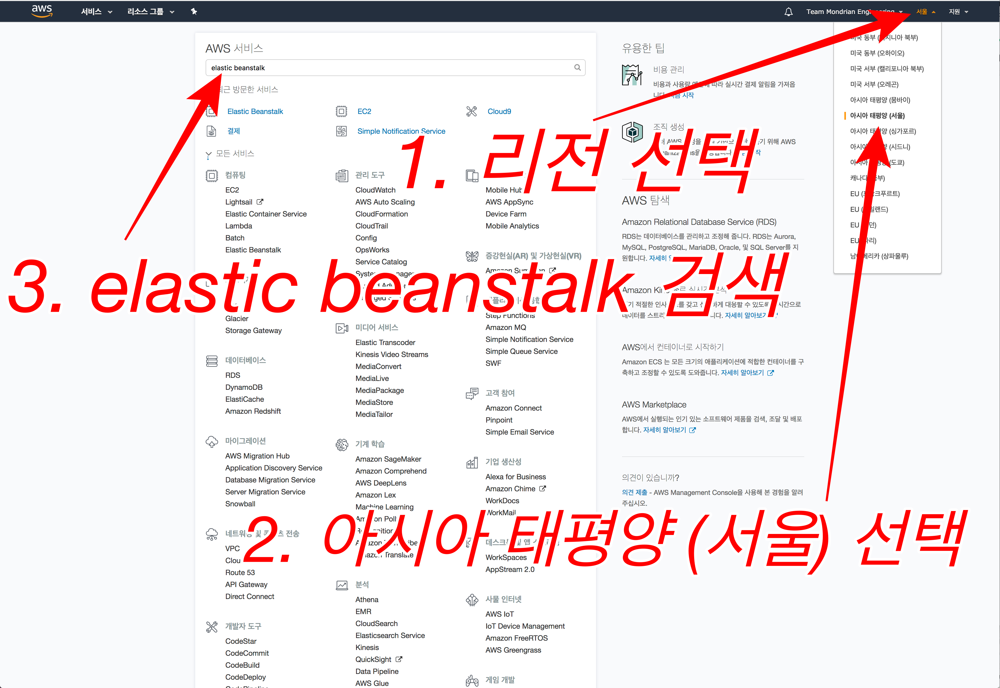
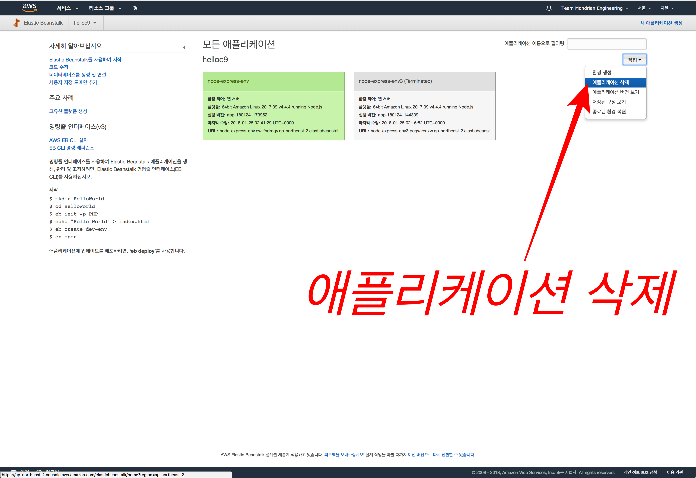
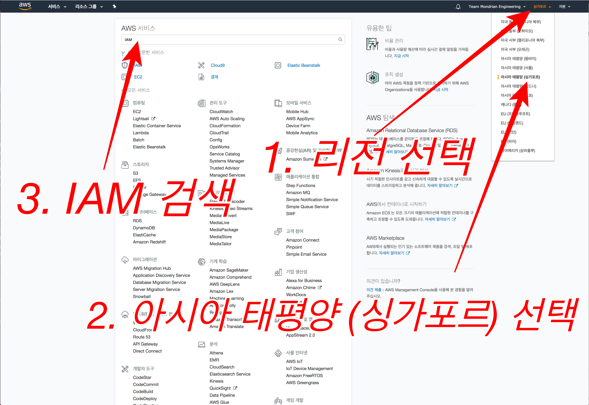
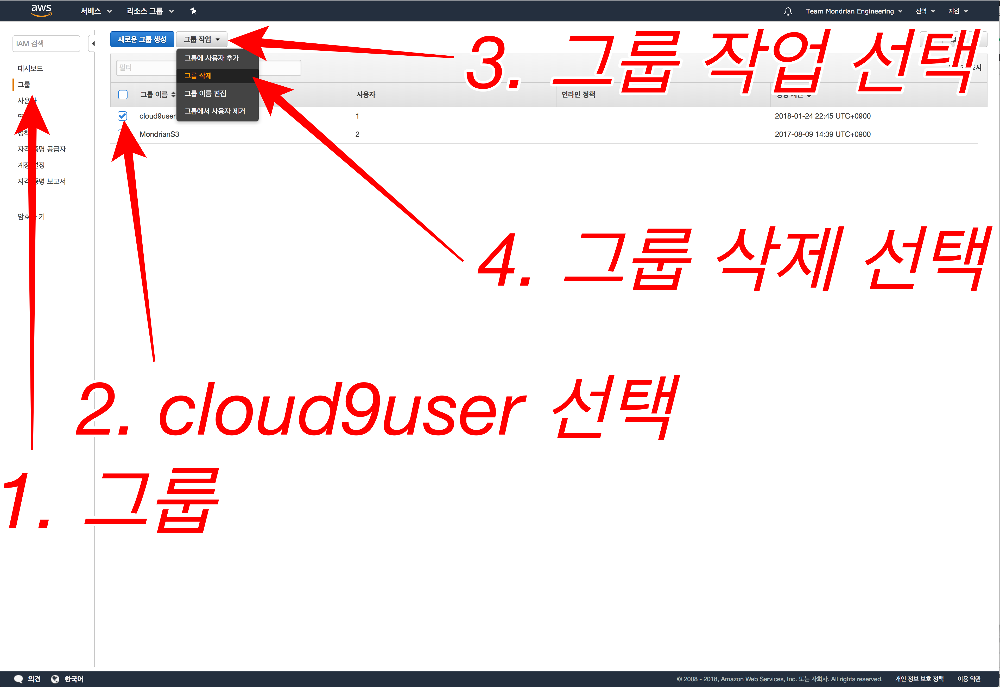

## Chapter 6. 삭제 가이드
**이 가이드는 중요합니다!**

## 1. Cloud 9 삭제

* 싱가포르 리전 선택
* `cloud9` 입력 후 **cloud9** 선택

* `c9only` 인스턴스 선택 후
* `Delete` 입력 후 **Delete** 버튼 선택
* `c9connect` 인스턴스 선택 후
* `Delete` 입력 후 **Delete** 버튼 선택

## 2. EC2 인스턴스 삭제

* 서울 리전 선택
* `EC2` 입력 후 **EC2** 선택

* 이전에 만든 인스턴스 선택(체크)
* **작업** **인스턴스 상태** **종료** 선택

## 3. Elastic Beanstalk 삭제

* 서울 리전 선택
* `elastic beanstalk` 입력 후 **Elastic Beanstalk** 선택

* **작업** 선택
* **애플리케이션 삭제** 선택
* **삭제** 선택

## 4. IAM 삭제

* 싱가폴 리전 선택
* `IAM` 입력 후 **IAM** 선택

* 좌측 **그룹** 선택 
* **cloud9user** 선택
* **그룹 작업** -> **그룹 삭제** 선택
* **예, 삭제** 선택

* 좌측 **사용자** 선택 
* **friend** 선택
* **사용자 삭제** 선택
* **한 명 이상의 사용자가 ....** **체크박스** 선택
* **예, 삭제** 선택

